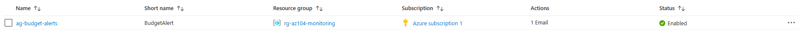
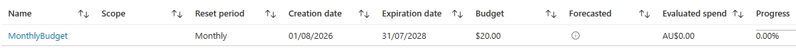
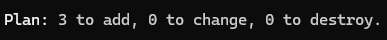
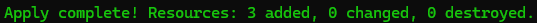

# Configuration 01 — Azure Cost Management and Budget

## Configuration Overview

This configuration demonstrates Azure cost governance using **Azure Cost Management budgets**, **Azure Monitor Action Groups**, email notifications, and Terraform.

The budget was first configured through the Azure Portal, then recreated with Terraform as Infrastructure as Code.

## Architecture

```text
Azure Subscription
   ↓
Monthly Budget
├── 50% Actual Threshold
├── 100% Actual Threshold
└── 100% Forecasted Threshold
   ↓
Azure Monitor Action Group
   ↓
Email Notification
```

## What I Configured

### Subscription Budget

Configured a subscription-level monthly Azure budget with:

- Budget amount: **$20 AUD**
- Reset period: **Monthly**
- Scope: **Subscription**
- 50% actual cost threshold
- 100% actual cost threshold
- 100% forecasted cost threshold

The budget monitored overall subscription spending rather than a specific resource group or service.

### Action Group and Notifications

Created an Azure Monitor Action Group with an email notification receiver.

The Action Group was linked to the budget thresholds so notifications could be sent when actual or forecasted spending reached the configured limits.

This separated cost monitoring from the notification mechanism and made the Action Group reusable for other Azure monitoring scenarios.

## Terraform Implementation

The same cost-governance configuration was recreated with Terraform.

Terraform managed **3 Azure resources**:

- 1 resource group
- 1 Azure Monitor Action Group
- 1 subscription-level Azure Cost Management budget

The Action Group included the email receiver directly within the Terraform resource.

The budget configuration included:

- 50% actual threshold
- 100% actual threshold
- 100% forecasted threshold
- Action Group integration
- Email notification

The notification email was supplied through a sensitive Terraform variable rather than hardcoded into the repository.

### Terraform Files

```text
terraform/
├── .terraform.lock.hcl
├── main.tf
├── providers.tf
├── variables.tf
└── versions.tf
```

## Security and Repository Practices

- The real notification email address was not hardcoded into Terraform.
- The email variable was marked as sensitive.
- Subscription details were obtained from the active Azure context rather than embedded in source code.
- Terraform state and working-directory files were excluded from source control.
- Subscription IDs, tenant IDs, and personal information were excluded from public evidence.
- The budget was used for monitoring and notification rather than automatically stopping Azure resources.

## Evidence

### Action Group Configuration



### Budget Alert Configuration



### Terraform Plan



### Terraform Deployment



## Skills Demonstrated

- Azure Cost Management
- Subscription-level budgets
- Actual cost thresholds
- Forecasted cost thresholds
- Azure Monitor Action Groups
- Email notifications
- Azure cost governance
- Terraform Infrastructure as Code
- Terraform sensitive variables
- Azure subscription administration
- Azure resource cleanup and cost awareness

## Outcome

This configuration demonstrated practical Azure cost governance using a subscription-level budget with actual and forecasted spending thresholds.

The same configuration was successfully reproduced with Terraform while keeping environment-specific notification details out of the public repository.