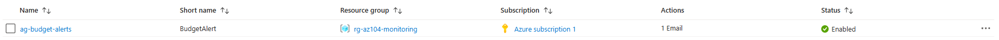
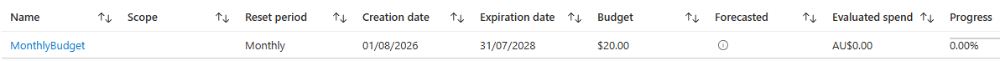
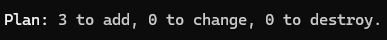
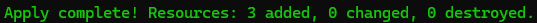

# Azure Cost Management Budget and Alerts

## Overview

I configured a subscription-level Azure Cost Management budget with actual and forecast thresholds, then routed notifications through an Azure Monitor Action Group.

After validating the setup through the Azure Portal, I recreated the same cost controls with Terraform.

## Architecture

```text
Azure Subscription
   ↓
Monthly Budget
├── 50% Actual Threshold
├── 100% Actual Threshold
└── 100% Forecasted Threshold
   ↓
Azure Monitor Action Group
   ↓
Email Notification
```

## What I Configured

### Subscription Budget

Configured a subscription-level monthly Azure budget with:

- Budget amount: **$20 AUD**
- Reset period: **Monthly**
- Scope: **Subscription**
- 50% actual cost threshold
- 100% actual cost threshold
- 100% forecasted cost threshold

The budget monitored overall subscription spending rather than a specific resource group or Azure service.

### Action Group and Notifications

Created an Azure Monitor Action Group with an email notification receiver.

The Action Group was linked to the budget thresholds so notifications could be sent when actual or forecasted spending reached the configured limits.

Using the Action Group kept notification delivery separate from the budget configuration and allowed the same notification mechanism to be reused for other Azure monitoring scenarios.

## Terraform Implementation

I recreated the cost-management setup with Terraform.

Terraform managed **3 Azure resources**:

- 1 resource group
- 1 Azure Monitor Action Group
- 1 subscription-level Azure Cost Management budget

The Terraform budget included:

- 50% actual threshold
- 100% actual threshold
- 100% forecasted threshold
- Action Group integration
- Direct email notification

The notification email address was supplied through a sensitive Terraform variable rather than hardcoded into the repository.

### Terraform Files

```text
terraform/
├── .terraform.lock.hcl
├── main.tf
├── providers.tf
├── variables.tf
└── versions.tf
```

## Security and Repository Practices

- The real notification email address was not hardcoded into Terraform
- The email variable was marked as sensitive
- Subscription details were obtained from the active Azure context rather than embedded in source code
- Terraform state, plan and working-directory files were excluded from source control
- Subscription IDs, tenant IDs and personal information were excluded from public evidence
- The budget was used for monitoring and notification rather than automatically stopping Azure resources

## Evidence

### Action Group Configuration



### Budget Alert Configuration



### Terraform Plan



### Terraform Deployment



## Key Skills

- Azure Cost Management
- Subscription-level budgets
- Actual cost thresholds
- Forecasted cost thresholds
- Azure Monitor Action Groups
- Email notifications
- Azure cost governance
- Terraform Infrastructure as Code
- Terraform sensitive variables
- Azure subscription administration
- Azure resource cleanup and cost awareness

## Result

Validated subscription-level Azure cost monitoring using actual and forecast thresholds with notification through Azure Monitor.

The same cost controls were successfully reproduced with Terraform while keeping the real notification address out of the public repository.