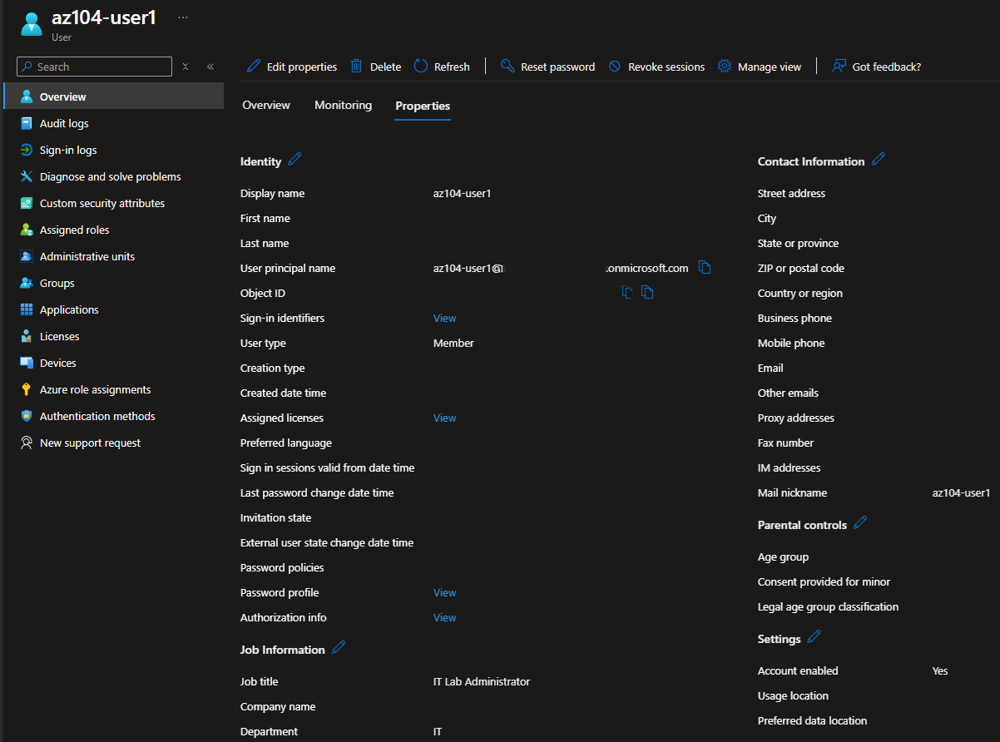
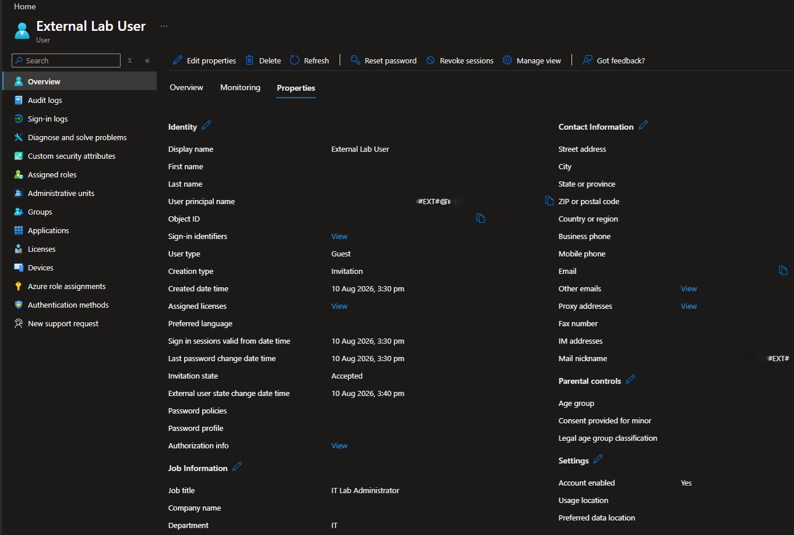
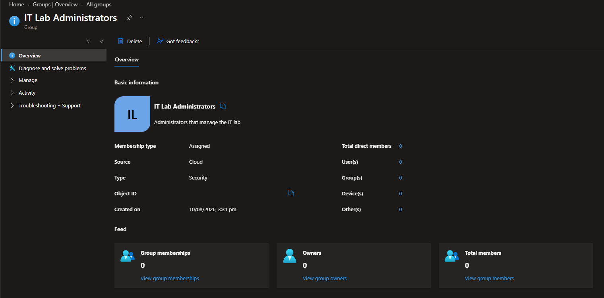
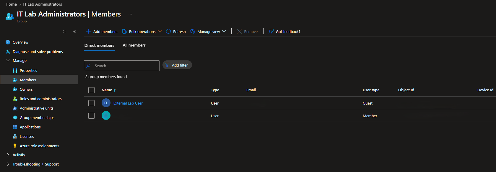

# Configuration 02 — Identity and Governance

## Configuration Overview

This configuration demonstrates core **Microsoft Entra ID identity administration** using internal users, external guest identities, security groups, and group-based access management.

The environment was configured and validated through the Microsoft Entra admin centre as part of hands-on Azure administration practice.

## Architecture

```text
Microsoft Entra ID
   │
   ├── Internal User
   │   └── Member
   │
   ├── External User
   │   └── Guest
   │
   └── Security Group
       └── Assigned Membership
           ├── Internal User
           └── External Guest
```

## What I Configured

### Internal Microsoft Entra User

Created a cloud-managed internal Microsoft Entra user with:

- User type: **Member**
- Account status: **Enabled**
- Cloud-managed identity

This demonstrated the standard identity model for an internal organisational user.

### External Guest Identity

Invited an external identity into the tenant as a **Guest** user.

This demonstrated Microsoft Entra external collaboration and the distinction between:

```text
Internal identity → Member
External identity → Guest
```

### Security Group and Membership

Created the security group:

```text
IT Lab Administrators
```

Configured:

- Group type: **Security**
- Membership type: **Assigned**

Both the internal Member identity and external Guest identity were added to the group.

This demonstrated how Microsoft Entra groups can centralise access management instead of assigning permissions individually to each user.

## Security and Repository Practices

- Personal email addresses were excluded from public evidence.
- Personal user principal names were redacted where not required.
- Microsoft Entra Object IDs were not published.
- Tenant and subscription IDs were excluded from screenshots.
- Authentication credentials were not stored in the repository.
- Generic lab identities were retained where they provided useful technical context.

## Evidence

### Internal Microsoft Entra User



### External Guest Identity



### Security Group Configuration



### Group Membership



## Skills Demonstrated

- Microsoft Entra ID
- Cloud user administration
- Member identities
- Guest identities
- External collaboration
- Security groups
- Assigned group membership
- Group-based access management
- Identity lifecycle administration
- Privacy-conscious evidence handling

## Outcome

This configuration demonstrated practical Microsoft Entra ID administration using internal and external identities with centralised security-group membership.

An internal Member user and external Guest user were created, validated, and added to an Assigned security group to provide a foundation for later Azure RBAC and governance configurations.