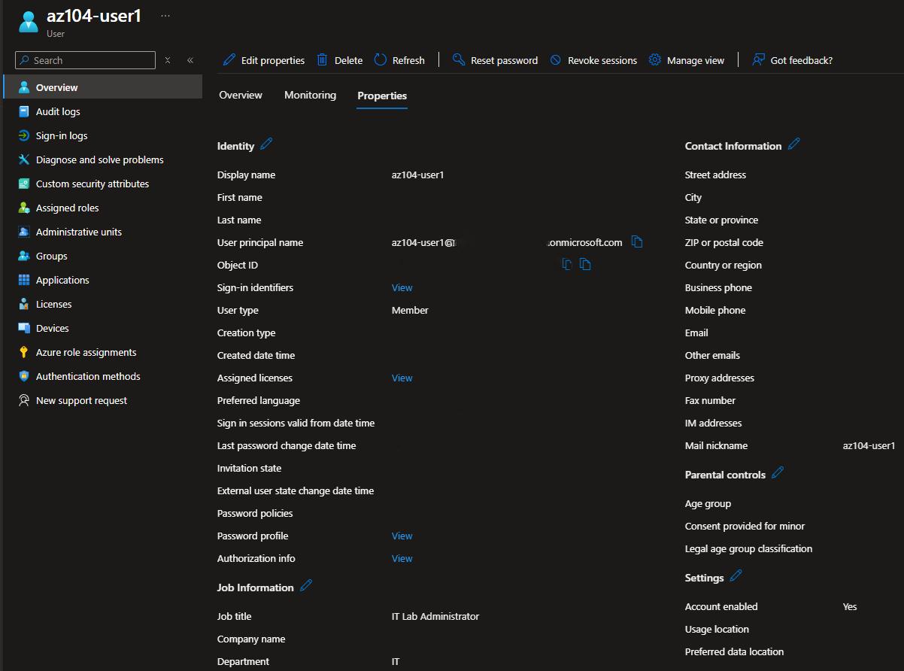
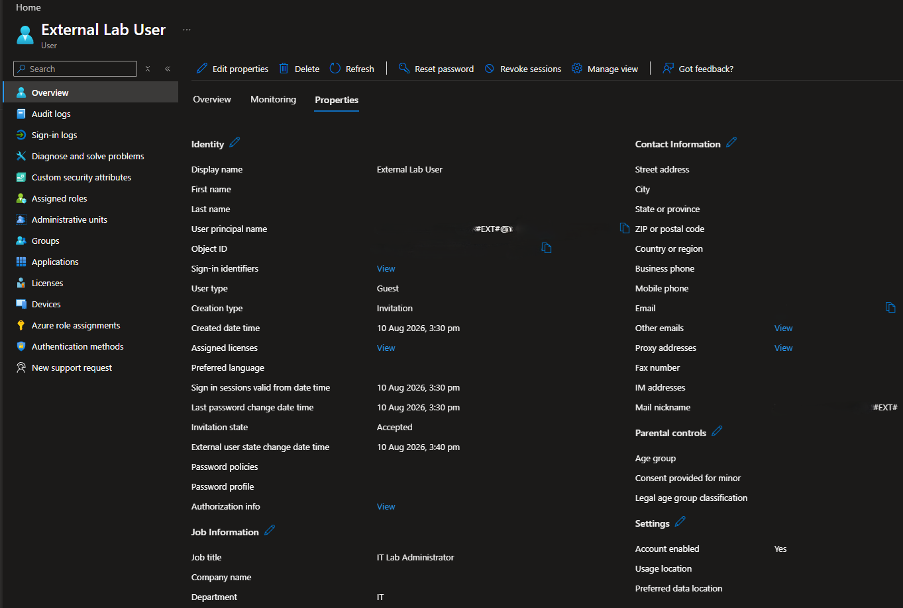
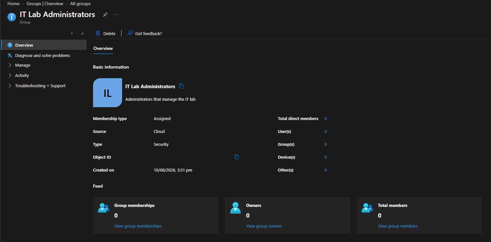
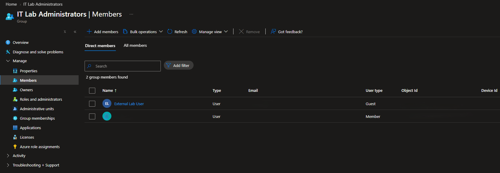

# Microsoft Entra ID Users and Groups

## Overview

I created and validated internal and external identities in Microsoft Entra ID, then managed both through an assigned security group.

The lab covered cloud user administration, Guest access and group-based identity management as a foundation for later Azure RBAC and governance work.

## Architecture

```text
Microsoft Entra ID
   │
   ├── Internal User
   │   └── Member
   │
   ├── External User
   │   └── Guest
   │
   └── Security Group
       └── Assigned Membership
           ├── Internal User
           └── External Guest
```

## What I Configured

### Internal Microsoft Entra User

Created a cloud-managed Microsoft Entra user with:

- User type: **Member**
- Account status: **Enabled**
- Cloud-managed identity

The account represented a standard internal organisational identity managed directly in Microsoft Entra ID.

### External Guest Identity

Invited an external identity into the tenant as a **Guest** user.

This validated the distinction between internal and external identities:

```text
Internal identity → Member
External identity → Guest
```

### Security Group and Membership

Created the security group:

```text
IT Lab Administrators
```

Configured:

- Group type: **Security**
- Membership type: **Assigned**

Both the internal Member identity and external Guest identity were added to the group.

Managing access through group membership provides a more scalable approach than assigning access individually to each user.

## Security and Repository Practices

- Personal email addresses were excluded from public evidence
- Personal user principal names were redacted where not required
- Microsoft Entra Object IDs were not published
- Tenant and subscription IDs were excluded from screenshots
- Authentication credentials were not stored in the repository
- Generic lab identities were retained where they provided useful technical context

## Evidence

### Internal Microsoft Entra User



### External Guest Identity



### Security Group Configuration



### Group Membership



## Key Skills

- Microsoft Entra ID
- Cloud user administration
- Member identities
- Guest identities
- External collaboration
- Security groups
- Assigned group membership
- Group-based access management
- Identity administration
- Privacy-conscious evidence handling

## Result

Created and validated an internal Member identity, an external Guest identity and an assigned Microsoft Entra security group.

Both identities were managed through group membership, providing a clean foundation for the Azure RBAC and governance work used elsewhere in the portfolio.