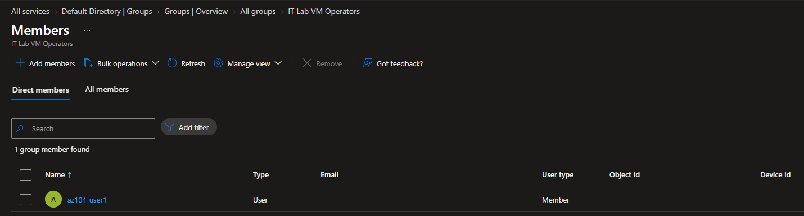
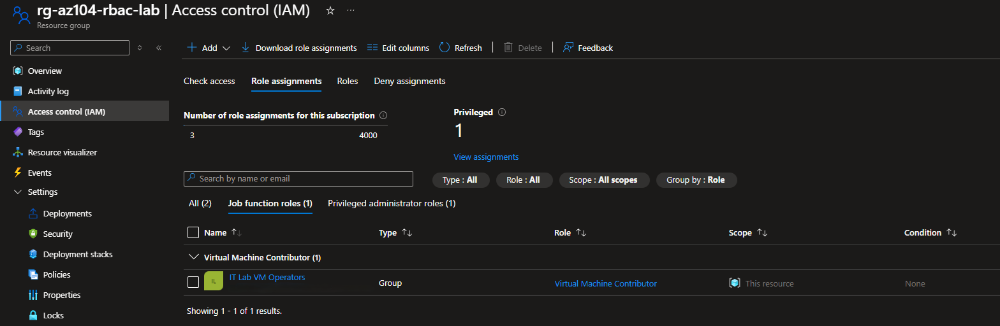

# Configuration 03 — Azure Role-Based Access Control

## Configuration Overview

This configuration demonstrates group-based Azure access control using **Microsoft Entra ID** and **Azure Role-Based Access Control (RBAC)**.

A Microsoft Entra security group was used to assign virtual machine administration permissions at resource group scope, allowing access to be managed through group membership instead of direct user role assignments.

## Architecture

```text
Microsoft Entra ID
   ↓
IT Lab VM Operators
   ↓
az104-user1
   ↓
Azure RBAC
   ↓
Virtual Machine Contributor
   ↓
rg-az104-rbac-lab
```

## What I Configured

### Microsoft Entra Security Group

Created the security group:

```text
IT Lab VM Operators
```

Configured:

- Group type: **Security**
- Membership type: **Assigned**

The lab user `az104-user1` was added as a direct member of the group.

### Azure RBAC Assignment

Assigned the built-in Azure role:

```text
Virtual Machine Contributor
```

to the `IT Lab VM Operators` security group.

The assignment was scoped to:

```text
rg-az104-rbac-lab
```

rather than the full Azure subscription.

### Least-Privilege Access

The user received Azure permissions through:

```text
User
   ↓
Security Group
   ↓
RBAC Role
   ↓
Resource Group Scope
```

This demonstrated a scalable access-control model where permissions remain assigned to the group while individual access can be managed through group membership.

## Validation

Azure Access Control (IAM) was used to confirm:

- Principal: `IT Lab VM Operators`
- Principal type: **Group**
- Role: **Virtual Machine Contributor**
- Scope: **Resource group**

This verified that the user received Azure permissions through group membership rather than a direct user-level role assignment.

## Security and Repository Practices

- Azure permissions were assigned to a security group rather than directly to an individual user.
- The role assignment used a built-in Azure role.
- Access was limited to a dedicated resource group rather than subscription scope.
- Group membership can be changed without modifying the Azure role assignment.
- Personal identity information and unnecessary Azure identifiers were excluded from public evidence.

## Evidence

### Microsoft Entra Group Membership



### Azure RBAC Role Assignment



## Skills Demonstrated

- Azure Role-Based Access Control
- Access Control (IAM)
- Microsoft Entra ID
- Security groups
- Group-based access management
- Azure built-in roles
- Virtual Machine Contributor
- Resource group scope
- Least-privilege access
- Role assignment validation
- Identity and access administration

## Outcome

This configuration demonstrated practical Azure RBAC administration using Microsoft Entra group-based access.

The `IT Lab VM Operators` security group was assigned the **Virtual Machine Contributor** role at resource group scope, allowing `az104-user1` to receive permissions through group membership while maintaining a scalable least-privilege access model.