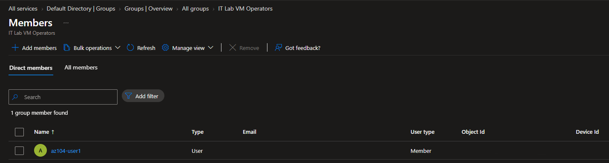
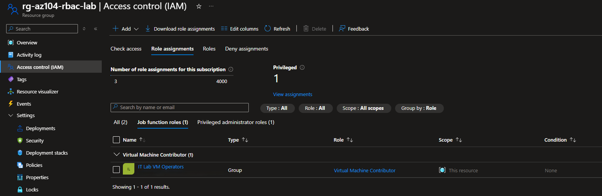

# Azure RBAC with Entra Groups

## Overview

I configured group-based Azure access using Microsoft Entra ID and Azure Role-Based Access Control (RBAC).

The built-in **Virtual Machine Contributor** role was assigned to a Microsoft Entra security group at resource-group scope, allowing user access to be managed through group membership rather than direct role assignments.

## Architecture

```text
az104-user1
   ↓ Member of
IT Lab VM Operators
   ↓ Azure RBAC assignment
Virtual Machine Contributor
   ↓ Scope
rg-az104-rbac-lab
```

## What I Configured

### Microsoft Entra Security Group

Created the security group:

```text
IT Lab VM Operators
```

Configured:

- Group type: **Security**
- Membership type: **Assigned**

The lab user `az104-user1` was added as a direct member of the group.

### Azure RBAC Assignment

Assigned the built-in Azure role:

```text
Virtual Machine Contributor
```

to the `IT Lab VM Operators` security group.

The assignment was scoped to:

```text
rg-az104-rbac-lab
```

rather than the full Azure subscription.

### Group-Based Access

The access path was:

```text
User
   ↓
Security Group
   ↓
RBAC Role
   ↓
Resource Group Scope
```

This keeps the Azure role assignment attached to the group while individual access is controlled through group membership.

## Validation

Azure Access Control (IAM) was used to confirm:

- Principal: `IT Lab VM Operators`
- Principal type: **Group**
- Role: **Virtual Machine Contributor**
- Scope: **Resource group**

This verified that `az104-user1` received Azure permissions through group membership rather than a direct user-level role assignment.

## Security and Repository Practices

- Azure permissions were assigned to a security group rather than directly to an individual user
- A built-in Azure role was used instead of a custom role
- Access was limited to a dedicated resource group rather than subscription scope
- Group membership can be changed without modifying the Azure role assignment
- Personal identity information and unnecessary Azure identifiers were excluded from public evidence

## Evidence

### Microsoft Entra Group Membership



### Azure RBAC Role Assignment



## Key Skills

- Azure Role-Based Access Control
- Access Control (IAM)
- Microsoft Entra ID
- Security groups
- Group-based access management
- Azure built-in roles
- Virtual Machine Contributor
- Resource-group scope
- Least-privilege access
- Role assignment validation
- Identity and access administration

## Result

Validated group-based Azure RBAC at resource-group scope.

The `IT Lab VM Operators` security group was assigned the **Virtual Machine Contributor** role, allowing `az104-user1` to receive the required permissions through group membership without a direct user-level role assignment.