# Configuration 04 — Azure Storage Security and Access

## Configuration Overview

This configuration demonstrates secure Azure Storage administration using **Microsoft Entra ID**, **Azure RBAC**, **Shared Access Signatures (SAS)**, **Azure Files**, data-protection features, Object Replication, and Terraform.

The environment was first implemented and validated through the Azure Portal, then recreated and extended using Terraform as Infrastructure as Code.

## Architecture

```text
Microsoft Entra ID
   ↓
Azure RBAC
   ↓
Azure Storage
├── Blob Storage
│   ├── Private Container
│   ├── SAS Access
│   ├── Soft Delete
│   ├── Versioning
│   ├── Lifecycle Management
│   └── Object Replication
│
└── Azure Files
    ├── Identity-Based Access
    ├── File Share
    ├── Snapshot
    └── Recovery
```

## What I Configured

### Identity and Blob Access

Configured a private Blob container with Microsoft Entra ID authentication and Azure RBAC.

The lab user was assigned:

- Reader
- Storage Blob Data Contributor

This demonstrated the difference between management-plane visibility and data-plane access.

The user successfully authenticated with Microsoft Entra ID and uploaded data to the private container.

### Shared Access Signatures

Validated temporary delegated access using:

- User delegation SAS
- Service SAS
- Stored access policy

A service SAS was linked to a stored access policy and tested successfully.

The policy was then removed, which invalidated the previously working SAS and demonstrated central SAS revocation.

### Storage Administration

Used both **AzCopy** and **Azure Storage Explorer** to upload and manage Storage data.

This demonstrated command-line and graphical administration methods in addition to the Azure Portal.

### Azure Files and Data Protection

Configured and validated:

- Identity-based Azure Files access
- File share snapshots
- Snapshot recovery
- Azure Files soft delete
- Blob soft delete
- Blob versioning
- Blob change feed
- Lifecycle management

A file-share snapshot was successfully used as part of a recovery test.

### Object Replication

Configured Azure Blob Object Replication between source and destination containers.

A new test object was uploaded to the source container and successfully appeared in the destination after asynchronous replication completed.

## Terraform Implementation

The core storage environment was recreated and extended with Terraform.

Terraform currently defines **10 Azure resources**:

- 1 resource group
- 2 StorageV2 accounts
- 2 private Blob containers
- 2 Azure RBAC role assignments
- 1 lifecycle management policy
- 1 Azure Files share
- 1 Object Replication policy

The Terraform configuration also enabled:

- HTTPS-only traffic
- TLS 1.2
- Private Blob access
- Blob soft delete
- Container soft delete
- Azure Files soft delete
- Blob versioning
- Blob change feed
- Microsoft Entra authentication
- Azure Files identity integration

Environment-specific values such as Microsoft Entra Object IDs and globally unique Storage account names were supplied through variables rather than hardcoded into the repository.

Terraform deployment validation included:

```text
Plan: 5 to add, 0 to change, 0 to destroy.
```

```text
Apply complete! Resources: 5 added, 0 changed, 0 destroyed.
```

The Terraform environment was later extended with Azure Files, lifecycle management, and Object Replication.

### Terraform Files

```text
terraform/
├── .terraform.lock.hcl
├── main.tf
├── outputs.tf
├── providers.tf
├── variables.tf
└── versions.tf
```

## Security and Repository Practices

- Anonymous Blob access was disabled.
- Secure transfer was required.
- Minimum TLS version was set to TLS 1.2.
- Microsoft Entra ID and Azure RBAC were used for identity-based access.
- SAS tokens and full SAS URLs were excluded from public evidence.
- Storage account access keys were not published.
- Tenant IDs, subscription IDs, Microsoft Entra Object IDs, and personal information were excluded from screenshots.
- Environment-specific Terraform values were supplied through variables.
- Terraform state, plan, and working-directory files were excluded from source control.
- Validation focused on actual access and data behaviour rather than only resource creation.

## Evidence

### Azure RBAC Role Assignments

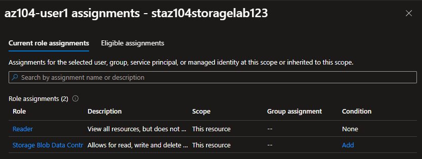

### Microsoft Entra Blob Access

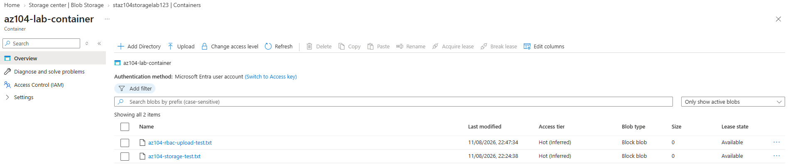

### SAS Revocation

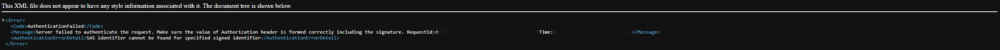

### AzCopy Upload

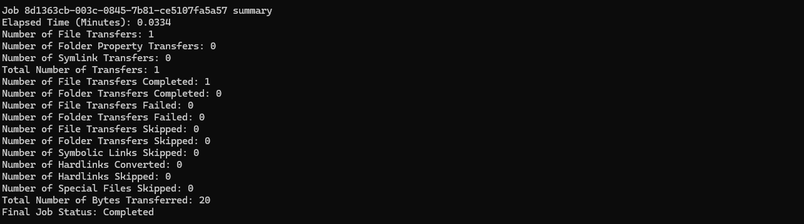

### Azure Storage Explorer

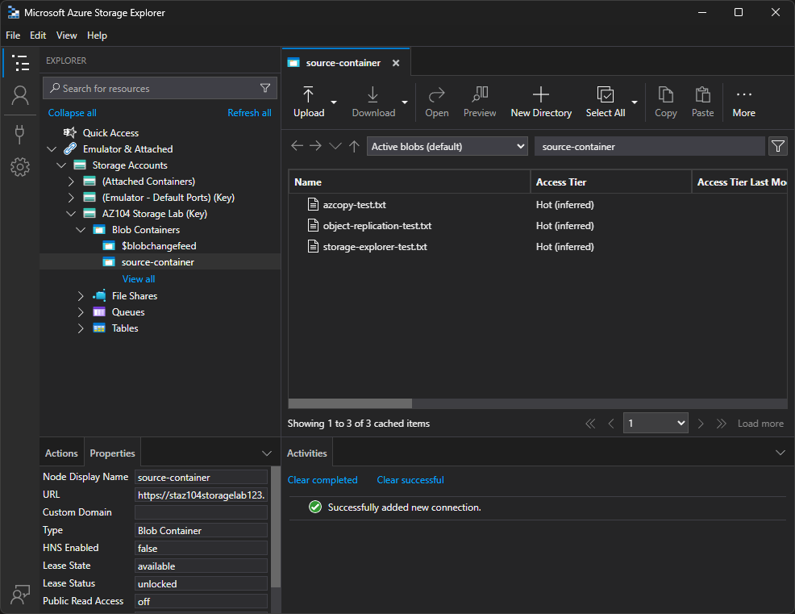

### Azure Files Identity-Based Access

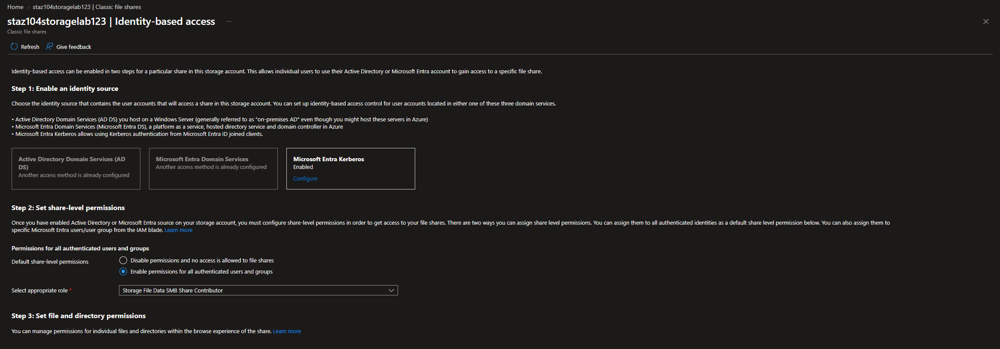

### Azure Files Snapshot Recovery

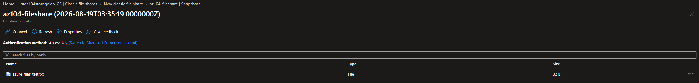

### Blob Lifecycle Management

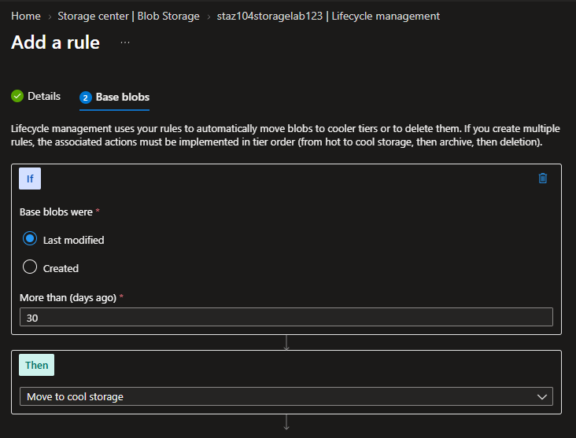

### Blob Object Replication

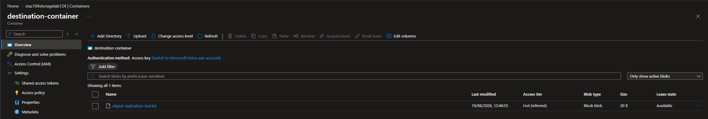

### Terraform Deployment

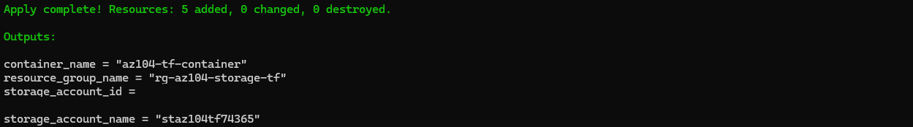

### Terraform Microsoft Entra and RBAC Validation

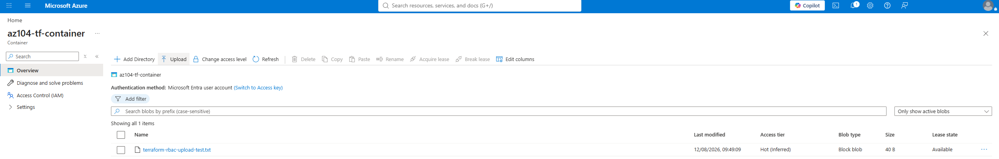

### Terraform Azure Files

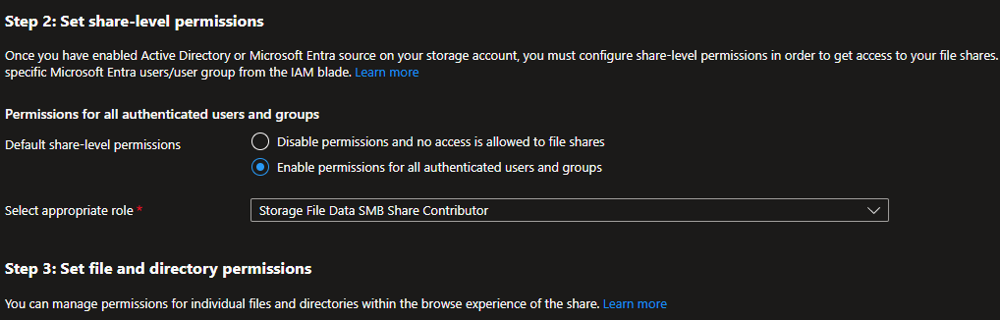

### Terraform Lifecycle Management

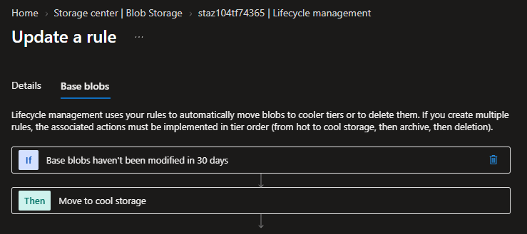

### Terraform Object Replication

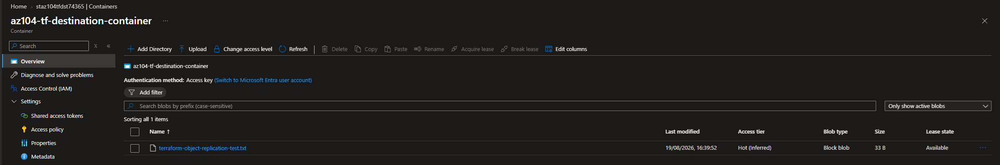

## Skills Demonstrated

- Azure Storage
- Blob Storage
- Azure Files
- Microsoft Entra ID
- Azure RBAC
- Management-plane and data-plane permissions
- Shared Access Signatures
- User delegation SAS
- Stored access policies
- SAS revocation
- AzCopy
- Azure Storage Explorer
- Blob soft delete
- Azure Files soft delete
- Blob versioning
- Blob change feed
- File-share snapshots and recovery
- Lifecycle management
- Object Replication
- Terraform Infrastructure as Code
- Azure resource security and validation

## Outcome

This configuration demonstrated secure Azure Storage administration across identity, delegated access, data protection, file services, data transfer, lifecycle management, and replication.

The same core storage architecture was then reproduced and extended with Terraform, with identity-based access, Azure Files, lifecycle management, and Object Replication validated through real data operations.