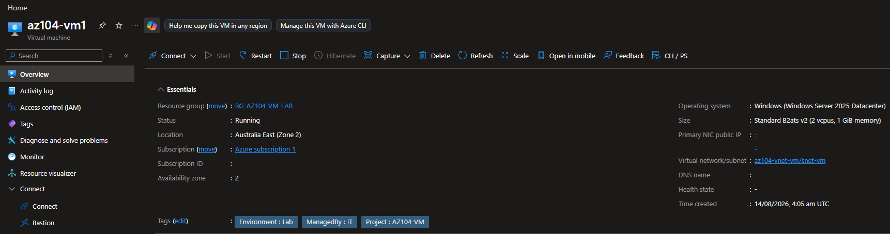
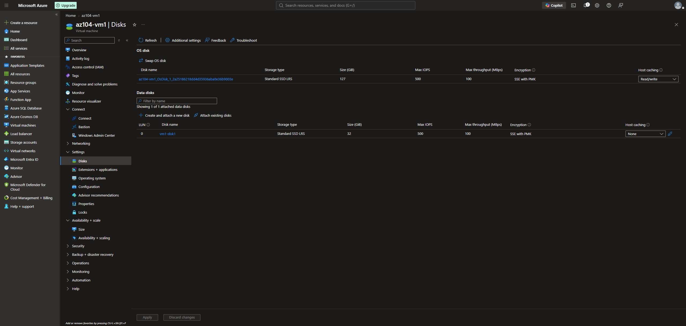
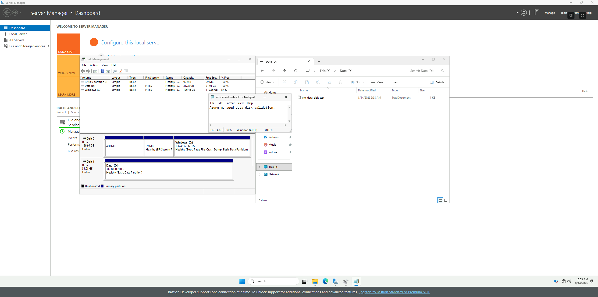
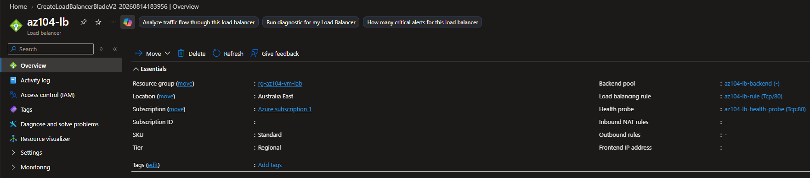
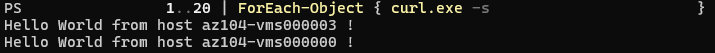
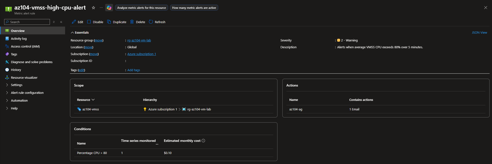
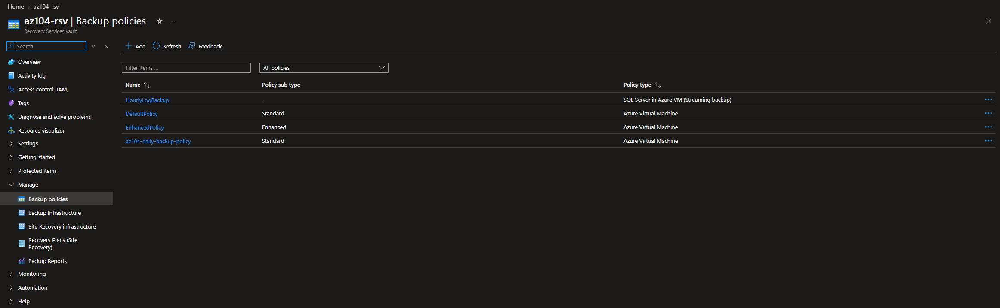
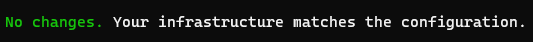
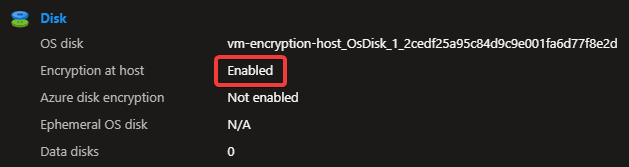

# Configuration 05 — Azure Virtual Machines

## Configuration Overview

This configuration demonstrates deployment and administration of Windows workloads using **Azure Virtual Machines**, **Virtual Machine Scale Sets**, **Azure Load Balancer**, managed disks, monitoring, backup, security features, and Terraform.

The environment was first implemented and validated through the Azure Portal. Terraform was then used to adopt existing Load Balancer infrastructure and deploy a separate Windows VM with **Encryption at Host** enabled.

## Architecture

```text
Azure Virtual Network
   │
   ├── Windows VM
   │   ├── Trusted Launch
   │   ├── Secure Boot / vTPM
   │   └── Managed Data Disk
   │
   └── Virtual Machine Scale Set
       ├── IIS Web Servers
       ├── Autoscaling
       └── Azure Load Balancer
              ├── Backend Pool
              ├── Health Probe
              └── HTTP Rule

Azure Monitor
├── CPU Alert
└── Action Group

Recovery Services Vault
└── VM Backup Policy
```

## What I Configured

### Windows Virtual Machine and Storage

Deployed a Windows Server virtual machine in Australia East with:

- Trusted Launch
- Secure Boot
- vTPM
- Azure virtual networking
- Azure Managed Disks

A separate **32 GiB Standard SSD** data disk was attached to the VM and then initialised and validated inside Windows.

### Virtual Machine Scale Set

Deployed a Windows Virtual Machine Scale Set to provide horizontally scalable compute capacity.

Validated:

- Manual scale out
- VMSS instance lifecycle
- CPU-based autoscaling
- Minimum instances: 1
- Maximum instances: 3

CPU load was deliberately generated to trigger scale-out behaviour and confirm Azure could adjust VMSS capacity based on utilisation.

### Azure Load Balancer

Configured a Standard public Azure Load Balancer in front of the VMSS with:

- Public frontend
- VMSS backend pool
- TCP port 80 health probe
- Port 80 load-balancing rule
- Outbound connectivity

IIS was installed on the VMSS instances and configured to return each server hostname.

Repeated requests to the Load Balancer returned responses from different VMSS instances:

```text
Hello World from host az104-vmss000003 !
Hello World from host az104-vmss000000 !
```

This confirmed that traffic was being distributed across multiple healthy backend instances.

### Monitoring and Backup

Configured an Azure Monitor CPU alert and Action Group for the VMSS.

A Recovery Services vault and custom Azure VM backup policy were also configured with:

- Daily backup schedule
- Seven-day daily retention
- Instant Restore retention
- Soft delete
- Locally redundant backup storage

Full backup and restore validation is demonstrated separately in **Configuration 14 — Azure Backup and Recovery**.

## Terraform Implementation

Terraform was used in two separate scenarios.

### Existing Infrastructure Adoption

Selected Azure Load Balancer resources were brought under Terraform management without recreating the working environment.

Terraform was used to manage:

- Standard Load Balancer
- Backend pool
- Health probe
- Load-balancing rule
- Outbound rule

Existing Azure resources were referenced through Terraform data sources rather than duplicated.

The final Terraform plan reported:

```text
No changes. Your infrastructure matches the configuration.
```

This confirmed that the imported infrastructure matched the Terraform configuration.

### Encryption at Host

A separate Terraform deployment created a Windows VM with **Encryption at Host** enabled.

Terraform deployed:

- 1 resource group
- 1 virtual network
- 1 subnet
- 1 network interface
- 1 Windows virtual machine

The VM was successfully validated in Azure with:

```text
Encryption at host: Enabled
```

The administrator password was supplied through a sensitive Terraform variable rather than hardcoded in the configuration.

### Terraform Files

```text
terraform/
├── .terraform.lock.hcl
├── main.tf
└── load-balancer.tf

terraform-vm-encryption/
├── .terraform.lock.hcl
├── main.tf
├── providers.tf
└── variables.tf
```

## Security and Repository Practices

- Trusted Launch, Secure Boot, and vTPM were enabled on the Windows VM.
- Encryption at Host was validated on the Terraform-deployed VM.
- VM administrator credentials were not committed to source control.
- Sensitive Terraform inputs were supplied through variables.
- Terraform state, backup, plan, and working-directory files were excluded from source control.
- Existing Azure infrastructure was adopted without unnecessary resource recreation.
- Subscription IDs, tenant IDs, credentials, and personal information were excluded from public evidence.
- Temporary lab resources were removed after validation to control Azure costs.

## Evidence

### Windows Virtual Machine



### Managed Data Disk



### Windows Data Disk Validation



### Azure Load Balancer



### Load Balancer Traffic Distribution



### VMSS CPU Alert



### Azure VM Backup Policy



### Terraform No-Drift Validation



### Terraform Encryption at Host Deployment


### Encryption at Host Verification



## Skills Demonstrated

- Azure Virtual Machines
- Windows Server
- Virtual Machine Scale Sets
- Azure Managed Disks
- Trusted Launch
- Secure Boot
- vTPM
- Encryption at Host
- VMSS manual scaling and autoscaling
- Azure Load Balancer
- Backend pools and health probes
- IIS workload validation
- Azure Monitor metric alerts
- Action Groups
- Recovery Services vaults
- Azure VM backup policies
- Terraform Infrastructure as Code
- Terraform resource imports
- Terraform data sources
- Terraform state and drift validation
- Azure resource cleanup

## Outcome

This configuration demonstrated practical administration of Windows compute workloads across deployment, storage, security, scaling, availability, monitoring, and Infrastructure as Code.

It validated real Load Balancer traffic distribution across VMSS instances, Terraform adoption of existing Azure infrastructure, and a separate Windows VM deployment with Encryption at Host successfully enabled.