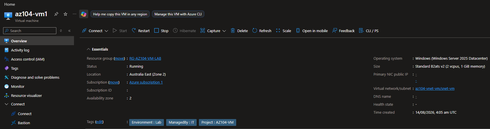
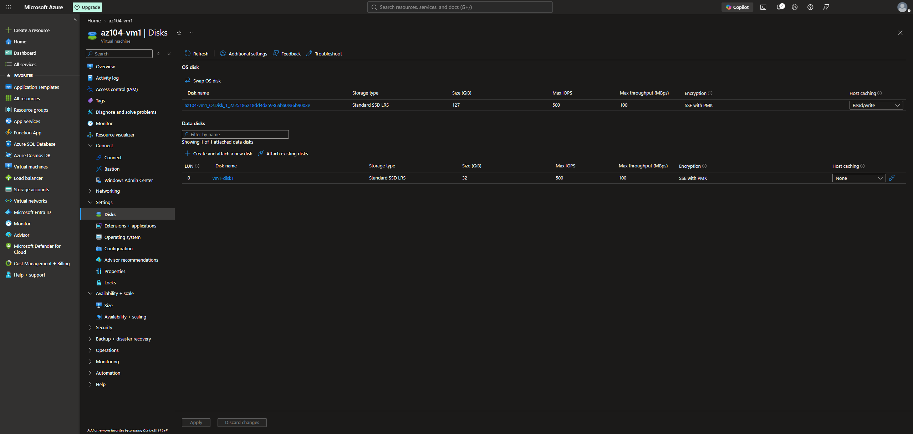
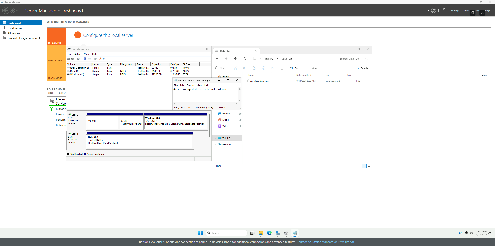
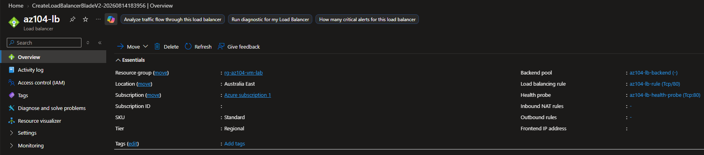
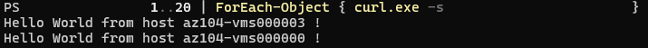
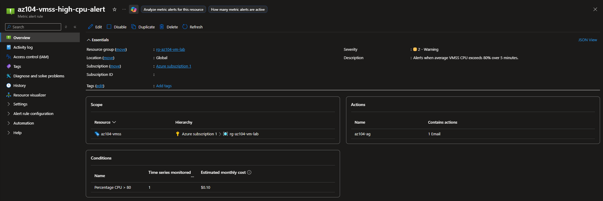
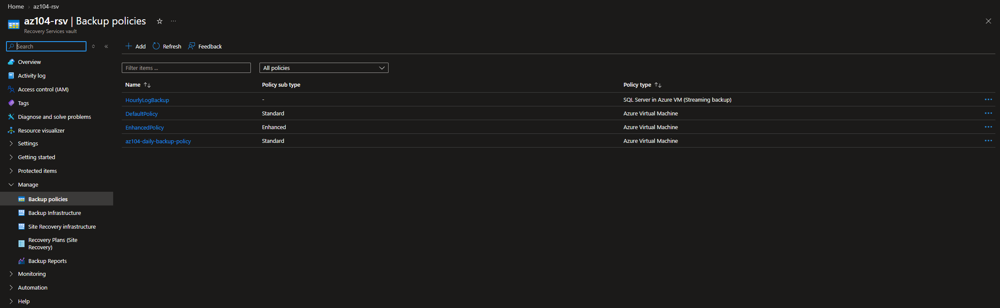
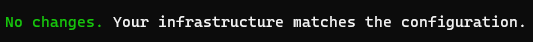
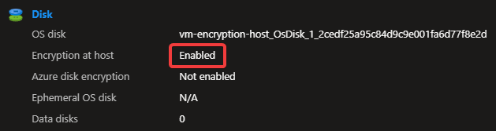

# Azure Virtual Machines, VMSS and Load Balancing

## Overview

I built and validated a Windows Azure compute lab covering a standalone virtual machine, managed disks, a Virtual Machine Scale Set, autoscaling, Azure Load Balancer, monitoring and backup.

I also completed Terraform exercises for existing Load Balancer discovery and import validation, and deployed a separate Windows VM with **Encryption at Host** enabled.

## Architecture

```text
Azure Virtual Network
   │
   ├── Windows VM
   │   ├── Trusted Launch
   │   ├── Secure Boot / vTPM
   │   └── Managed Data Disk
   │
   └── Virtual Machine Scale Set
       ├── IIS Web Servers
       ├── Autoscaling
       └── Azure Load Balancer
              ├── Backend Pool
              ├── Health Probe
              └── HTTP Rule

Azure Monitor
├── CPU Alert
└── Action Group

Recovery Services Vault
└── VM Backup Policy
```

## What I Configured

### Windows Virtual Machine and Storage

Deployed a Windows Server virtual machine in Australia East with:

- Trusted Launch
- Secure Boot
- vTPM
- Azure virtual networking
- Azure Managed Disks

A separate **32 GiB Standard SSD** data disk was attached to the VM, initialised and validated inside Windows.

### Virtual Machine Scale Set

Deployed a Windows Virtual Machine Scale Set to provide horizontally scalable compute capacity.

Validated:

- Manual scale out
- VMSS instance lifecycle
- CPU-based autoscaling
- Minimum instances: 1
- Maximum instances: 3

CPU load was deliberately generated to trigger scale-out behaviour and confirm Azure could adjust VMSS capacity based on utilisation.

### Azure Load Balancer

Configured a Standard public Azure Load Balancer in front of the VMSS with:

- Public frontend
- VMSS backend pool
- TCP port 80 health probe
- Port 80 load-balancing rule
- Outbound connectivity

IIS was installed on the VMSS instances and configured to return each server hostname.

Repeated requests to the Load Balancer returned responses from different VMSS instances:

```text
Hello World from host az104-vmss000003 !
Hello World from host az104-vmss000000 !
```

This confirmed that traffic was being distributed across multiple healthy backend instances.

### Monitoring and Backup

Configured an Azure Monitor CPU alert and Action Group for the VMSS.

A Recovery Services vault and custom Azure VM backup policy were also configured with:

- Daily backup schedule
- Seven-day daily retention
- Instant Restore retention
- Soft delete
- Locally redundant backup storage

Full backup and restore validation is covered separately in **Azure VM Backup and Recovery**.

## Terraform Implementation

Terraform was used in two separate exercises.

### Existing Load Balancer Discovery and Import Validation

During the lab, selected Azure Load Balancer resources were imported into Terraform state without recreating the working environment.

The import exercise covered:

- Standard Load Balancer
- Backend pool
- Health probe
- Load-balancing rule
- Outbound rule

The final Terraform plan reported:

```text
No changes. Your infrastructure matches the configuration.
```

This confirmed that the imported resources matched the Terraform configuration at the time of validation.

The public `terraform/` folder retains read-only data sources for the existing resource group, virtual network, subnet, VMSS, Load Balancer, public IP and backend pool. The temporary managed-resource HCL used during the import exercise was not retained, so it is not presented here as a reproducible managed deployment.

### Encryption at Host

A separate Terraform configuration defines:

- 1 resource group
- 1 virtual network
- 1 subnet
- 1 network interface
- 1 Windows virtual machine

The Windows VM was configured with:

```text
Encryption at host: Enabled
```

and the setting was validated in Azure after deployment.

The administrator password is supplied through a sensitive Terraform variable rather than hardcoded into the configuration.

### Terraform Files

```text
terraform/
├── .terraform.lock.hcl
└── main.tf

terraform-vm-encryption/
├── .terraform.lock.hcl
├── main.tf
├── providers.tf
└── variables.tf
```

## Security and Repository Practices

- Trusted Launch, Secure Boot and vTPM were enabled on the Windows VM
- Encryption at Host was validated on the Terraform-deployed VM
- VM administrator credentials were not committed to source control
- Sensitive Terraform input was supplied through a variable
- Terraform state, plan and working-directory files were excluded from source control
- Existing Azure infrastructure was inspected and imported without unnecessary resource recreation
- Subscription IDs, tenant IDs, credentials and personal information were excluded from public evidence
- Temporary lab resources were removed after validation to control Azure costs

## Evidence

### Windows Virtual Machine



### Managed Data Disk



### Windows Data Disk Validation



### Azure Load Balancer



### Load Balancer Traffic Distribution



### VMSS CPU Alert



### Azure VM Backup Policy



### Terraform No-Drift Validation



### Terraform Encryption at Host Deployment


### Encryption at Host Verification



## Key Skills

- Azure Virtual Machines
- Windows Server
- Virtual Machine Scale Sets
- Azure Managed Disks
- Trusted Launch
- Secure Boot
- vTPM
- Encryption at Host
- VMSS manual scaling and autoscaling
- Azure Load Balancer
- Backend pools and health probes
- IIS workload validation
- Azure Monitor metric alerts
- Action Groups
- Recovery Services vaults
- Azure VM backup policies
- Terraform Infrastructure as Code
- Terraform resource imports
- Terraform data sources
- Terraform state and no-drift validation
- Azure resource cleanup

## Result

Validated Windows compute administration across deployment, storage, security, scaling, load balancing, monitoring and backup.

The lab also demonstrated live Load Balancer traffic distribution across VMSS instances, Terraform import and no-drift validation against existing infrastructure, and a separate Windows VM deployment with Encryption at Host successfully enabled.