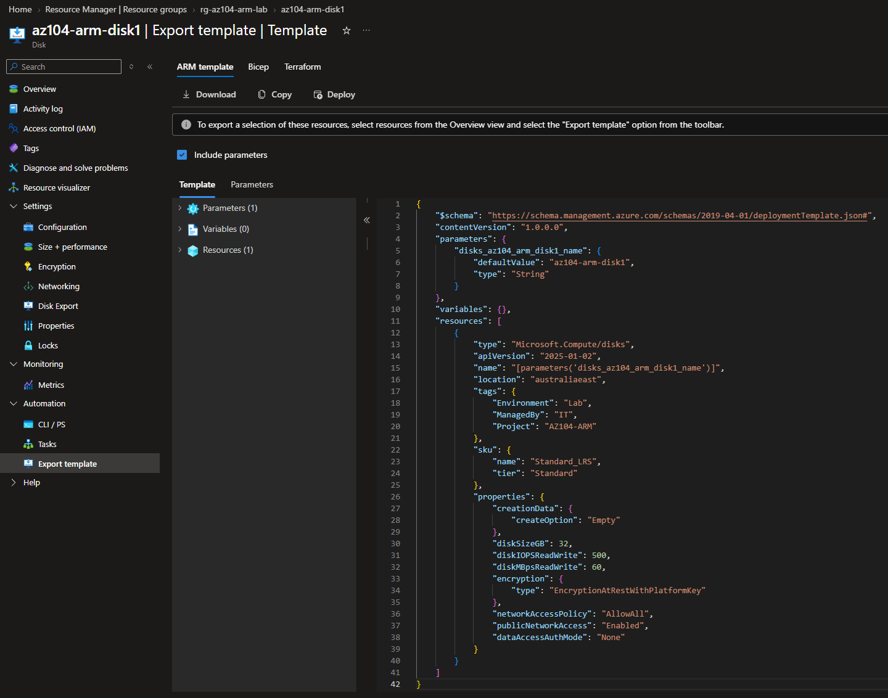
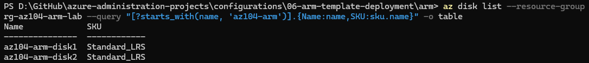
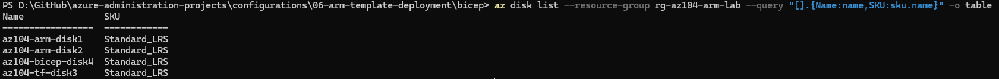

# Configuration 06 — ARM Templates, Bicep and Terraform

## Configuration Overview

This configuration demonstrates Azure Infrastructure as Code using **ARM templates**, **Bicep**, and **Terraform**.

A managed disk was first created through the Azure Portal, then reproduced using three Infrastructure as Code approaches to compare Azure-native and third-party deployment methods.

## Architecture

```text
Azure Portal
   ↓
Baseline Managed Disk
   ↓
Export ARM Template
   ↓
Parameterised ARM Deployment
   ↓
Bicep Conversion and Deployment

Terraform
   ↓
Equivalent Managed Disk
```

## What I Configured

### Azure Portal Baseline

Created a **32 GiB Standard HDD LRS** managed disk in Australia East as the baseline configuration.

```text
az104-arm-disk1
```

The existing Azure resource was then exported as an ARM template for reuse.

### ARM Template Deployment

Reviewed and modified the exported ARM template to make the disk name reusable through parameters.

The parameterised template was deployed with Azure CLI to create:

```text
az104-arm-disk2
```

Validation confirmed that the ARM-deployed disk matched the baseline disk configuration.

### Bicep Deployment

Converted the ARM template to Bicep and reviewed the generated configuration before deployment.

A read-only disk SKU property generated during conversion was removed before validating and deploying the Bicep file.

The Bicep deployment created:

```text
az104-bicep-disk4
```

### Infrastructure as Code Comparison

The completed environment demonstrated the same managed-disk configuration through four deployment approaches:

```text
Azure Portal  → az104-arm-disk1
ARM Template  → az104-arm-disk2
Bicep         → az104-bicep-disk4
Terraform     → az104-tf-disk3
```

All four disks used the same **32 GiB Standard HDD LRS** specification.

## Terraform Implementation

Terraform was used to create an equivalent managed disk for comparison with ARM and Bicep.

Terraform referenced the existing Azure resource group through a data source and managed:

- 1 Azure managed disk

The Terraform-managed disk was:

```text
az104-tf-disk3
```

A final Terraform plan confirmed:

```text
No changes. Your infrastructure matches the configuration.
```

This verified that the deployed resource matched the Terraform configuration.

### Infrastructure as Code Files

```text
arm/
├── parameters.json
└── template.json

bicep/
└── template.bicep

terraform/
├── .terraform.lock.hcl
└── main.tf
```

## Security and Repository Practices

- Azure authentication tokens were excluded from source control.
- Subscription and tenant IDs were excluded from public evidence.
- Personal credentials were not stored in the repository.
- Full Azure resource IDs containing subscription information were not published.
- Terraform state and working-directory files were excluded from source control.
- Screenshots were limited to relevant deployment and validation information.

## Evidence

### ARM Template Export



### ARM Deployment Validation



### Infrastructure as Code Comparison



### Terraform No-Drift Validation


## Skills Demonstrated

- Azure Resource Manager
- ARM templates
- ARM template parameters
- Bicep
- ARM-to-Bicep conversion
- Azure CLI
- Azure Managed Disks
- Infrastructure as Code
- Declarative deployments
- Terraform
- Terraform data sources
- Terraform state and drift validation
- Azure resource validation

## Outcome

This configuration demonstrated the transition from manual Azure Portal deployment to repeatable Infrastructure as Code.

The same managed-disk configuration was successfully reproduced with ARM templates, Bicep, and Terraform, demonstrating practical experience with multiple Azure deployment methods.