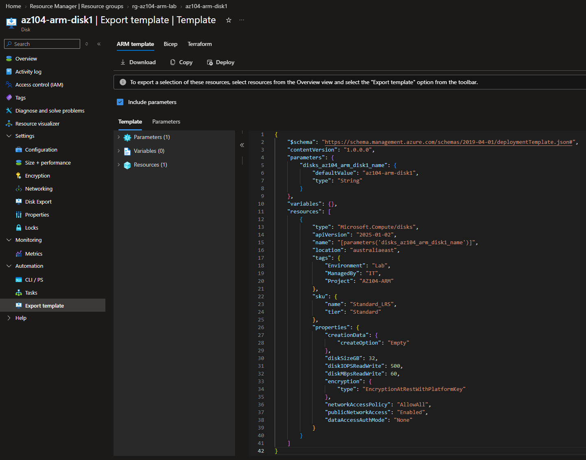
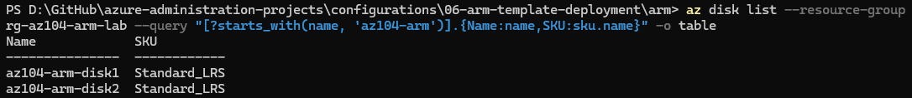
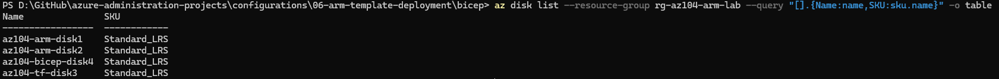

# ARM Templates, Bicep and Terraform

## Overview

I created the same Azure managed-disk configuration using four deployment approaches: the Azure Portal, ARM Templates, Bicep and Terraform.

The exercise started with a manually created baseline disk, then moved through Azure-native Infrastructure as Code and Terraform to compare repeatable deployment methods.

## Architecture

```text
Azure Portal
   ↓
Baseline Managed Disk
   ↓
Export ARM Template
   ↓
Parameterised ARM Deployment
   ↓
Bicep Conversion and Deployment

Terraform
   ↓
Equivalent Managed Disk
```

## What I Configured

### Azure Portal Baseline

Created a **32 GiB Standard HDD LRS** managed disk in Australia East as the baseline configuration:

```text
az104-arm-disk1
```

The existing Azure resource was then exported as an ARM template for reuse.

### ARM Template Deployment

Reviewed and modified the exported ARM template so the disk name could be supplied through a parameter.

The parameterised template was deployed with Azure CLI to create:

```text
az104-arm-disk2
```

Validation confirmed that the ARM-deployed disk matched the baseline disk specification.

### Bicep Deployment

Converted the ARM template to Bicep and reviewed the generated configuration before deployment.

A read-only disk SKU property generated during conversion was removed before validation and deployment.

The Bicep deployment created:

```text
az104-bicep-disk4
```

### Infrastructure as Code Comparison

The completed environment reproduced the same managed-disk specification through four approaches:

```text
Azure Portal  → az104-arm-disk1
ARM Template  → az104-arm-disk2
Bicep         → az104-bicep-disk4
Terraform     → az104-tf-disk3
```

All four disks used the same **32 GiB Standard HDD LRS** specification.

## Terraform Implementation

Terraform was used to create an equivalent managed disk for comparison with ARM and Bicep.

The configuration references the existing Azure resource group through a data source and manages:

- 1 Azure managed disk

The Terraform-managed disk was:

```text
az104-tf-disk3
```

A final Terraform plan reported:

```text
No changes. Your infrastructure matches the configuration.
```

This confirmed that the deployed disk matched the Terraform configuration.

### Infrastructure as Code Files

```text
arm/
├── parameters.json
└── template.json

bicep/
└── template.bicep

terraform/
├── .terraform.lock.hcl
└── main.tf
```

## Security and Repository Practices

- Azure authentication tokens were excluded from source control
- Subscription and tenant IDs were excluded from public evidence
- Personal credentials were not stored in the repository
- Full Azure resource IDs containing subscription information were not published
- Terraform state, plan and working-directory files were excluded from source control
- Screenshots were limited to relevant deployment and validation information

## Evidence

### ARM Template Export



### ARM Deployment Validation



### Infrastructure as Code Comparison



### Terraform No-Drift Validation


## Key Skills

- Azure Resource Manager
- ARM Templates
- ARM template parameters
- Bicep
- ARM-to-Bicep conversion
- Azure CLI
- Azure Managed Disks
- Infrastructure as Code
- Declarative deployments
- Terraform
- Terraform data sources
- Terraform state and no-drift validation
- Azure resource validation

## Result

Reproduced the same Azure managed-disk configuration with ARM Templates, Bicep and Terraform after creating the original Azure Portal baseline.

The lab validated multiple Infrastructure as Code approaches against the same resource specification and confirmed the Terraform-managed disk with a no-drift plan.