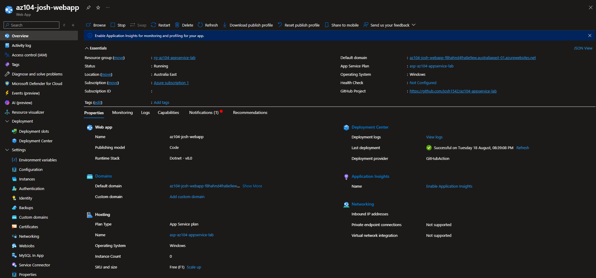
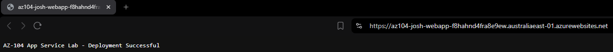
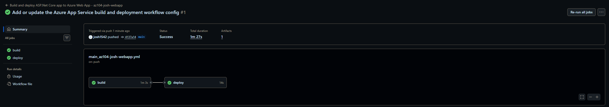
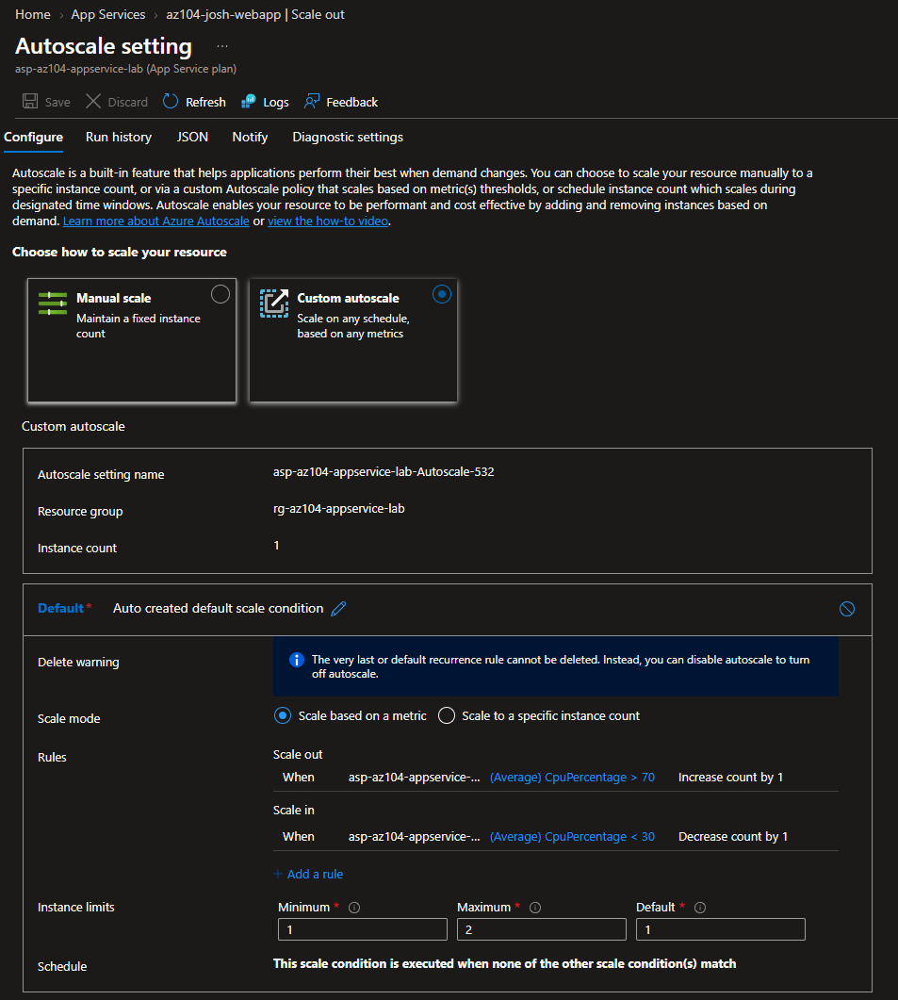
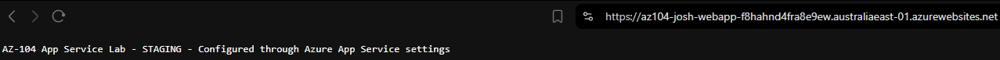
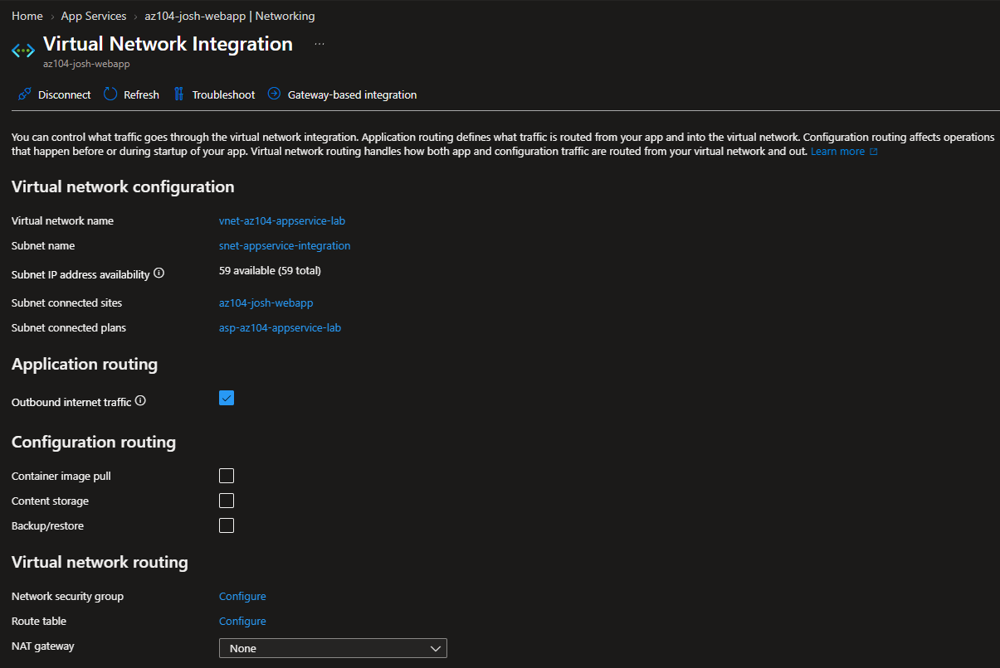
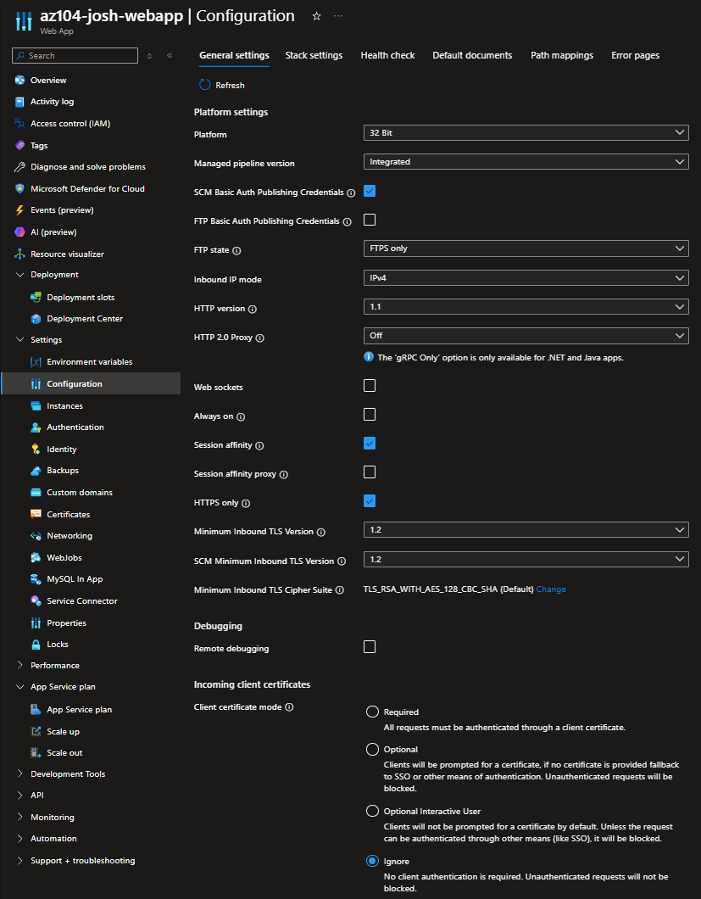
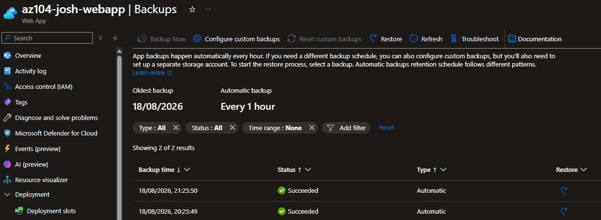

# Configuration 07 — Azure App Service

## Configuration Overview

This configuration demonstrates deployment and administration of an Azure web application using **Azure App Service**, **GitHub Actions CI/CD**, deployment slots, autoscaling, VNet integration, TLS, backups, and Terraform.

The environment was first implemented and validated through the Azure Portal, then recreated with Terraform as Infrastructure as Code.

## Architecture

```text
GitHub Repository
   ↓
GitHub Actions
   ↓
Azure App Service
├── Production Slot
├── Staging Slot
├── Autoscale
├── VNet Integration
├── TLS / HTTPS
└── Automatic Backup

Terraform
   ↓
App Service Infrastructure
```

## What I Configured

### Application Deployment and CI/CD

Deployed an ASP.NET Core application to Azure App Service and validated the live Azure endpoint.

Configured **GitHub Actions** to automatically build and deploy application changes from source control to Azure.

The application code and CI/CD workflow are maintained in a separate repository:

[az104-appservice-lab](https://github.com/josh1542/az104-appservice-lab)

### Scaling

Validated multiple App Service scaling options:

- Vertical scaling through App Service Plan tiers
- Manual horizontal scale out
- Azure Monitor Autoscale

Autoscale was configured to operate between **1 and 3 instances** based on CPU utilisation.

### Deployment Slots

Created a **staging deployment slot** for application validation before production release.

Validated the staging deployment and performed a **slot swap** to promote the tested version into production.

### Networking and Security

Configured:

- Azure Virtual Network integration
- Dedicated delegated subnet
- HTTPS-only access
- Minimum TLS version 1.2
- Application settings / environment variables

### Backup

Configured App Service automatic backup capability as part of the application recovery configuration.

## Terraform Implementation

The core App Service infrastructure was recreated with Terraform.

Terraform managed **7 Azure resources**:

- 1 resource group
- 1 virtual network
- 1 delegated subnet
- 1 Windows App Service Plan
- 1 Windows Web App
- 1 staging deployment slot
- 1 Azure Monitor Autoscale setting

The Terraform implementation included:

- Windows App Service Plan using S1
- HTTPS-only access
- Minimum TLS 1.2
- Application settings
- VNet integration
- App Service subnet delegation
- Staging deployment slot
- CPU-based autoscaling

Autoscale was configured with:

```text
Minimum instances: 1
Default instances: 1
Maximum instances: 3

Scale out:
Average CPU > 70% for 5 minutes
Add 1 instance

Scale in:
Average CPU < 30% for 5 minutes
Remove 1 instance
```

The Terraform environment was successfully deployed and removed after validation to prevent unnecessary Azure costs.

### Terraform Files

```text
terraform/
├── .terraform.lock.hcl
├── main.tf
├── outputs.tf
├── providers.tf
├── variables.tf
└── versions.tf
```

## Security and Repository Practices

- HTTPS-only access was enabled.
- Minimum TLS version was set to TLS 1.2.
- Application settings were kept separate from application source code.
- A dedicated delegated subnet was used for App Service VNet integration.
- Staging and production deployment slots were separated.
- Terraform state, plan, and working-directory files were excluded from source control.
- Temporary and higher-cost Azure resources were removed after testing.
- Terraform managed infrastructure while GitHub Actions handled application deployment.

## Evidence

### Azure App Service Deployment



### Live Application



### GitHub Actions CI/CD



### Autoscale Configuration



### Staging Deployment Slot


### Production Slot After Swap



### VNet Integration



### TLS Configuration



### Automatic Backup



## Skills Demonstrated

- Azure App Service
- App Service Plans
- Azure Web Apps
- GitHub Actions
- CI/CD
- Deployment slots
- Slot swaps
- Vertical and horizontal scaling
- Azure Monitor Autoscale
- VNet integration
- Subnet delegation
- Application settings
- HTTPS and TLS
- App Service backup
- Terraform Infrastructure as Code
- Azure resource cleanup and cost control

## Outcome

This configuration demonstrated an end-to-end Azure App Service workflow covering application deployment, CI/CD, scaling, release management, networking, security, and recovery.

The core App Service infrastructure was also reproduced with Terraform, while GitHub Actions remained responsible for automated application deployment.