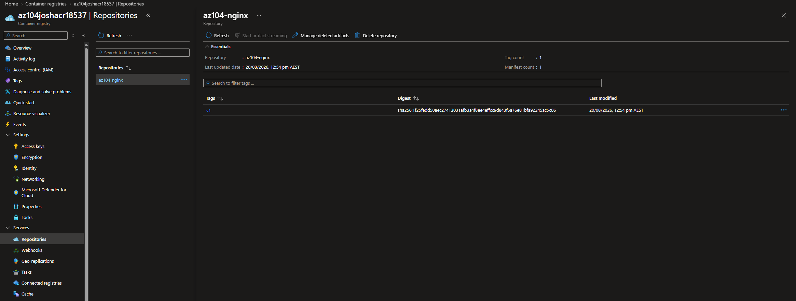
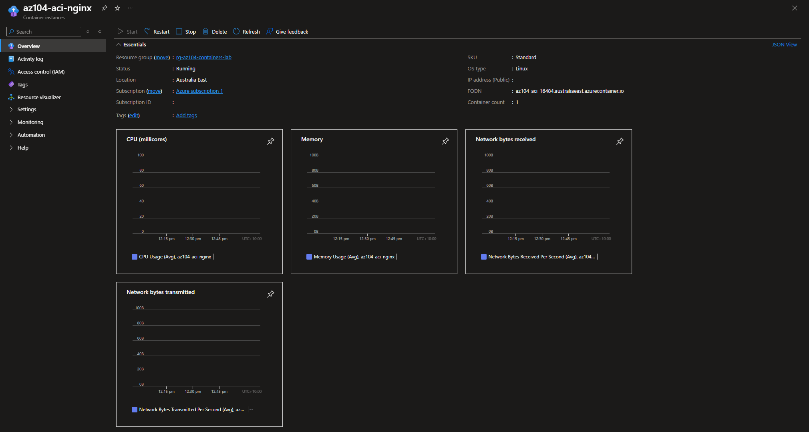
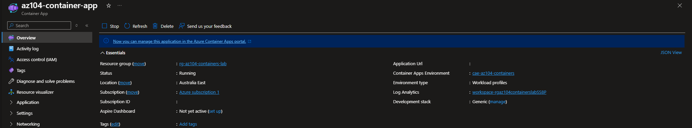
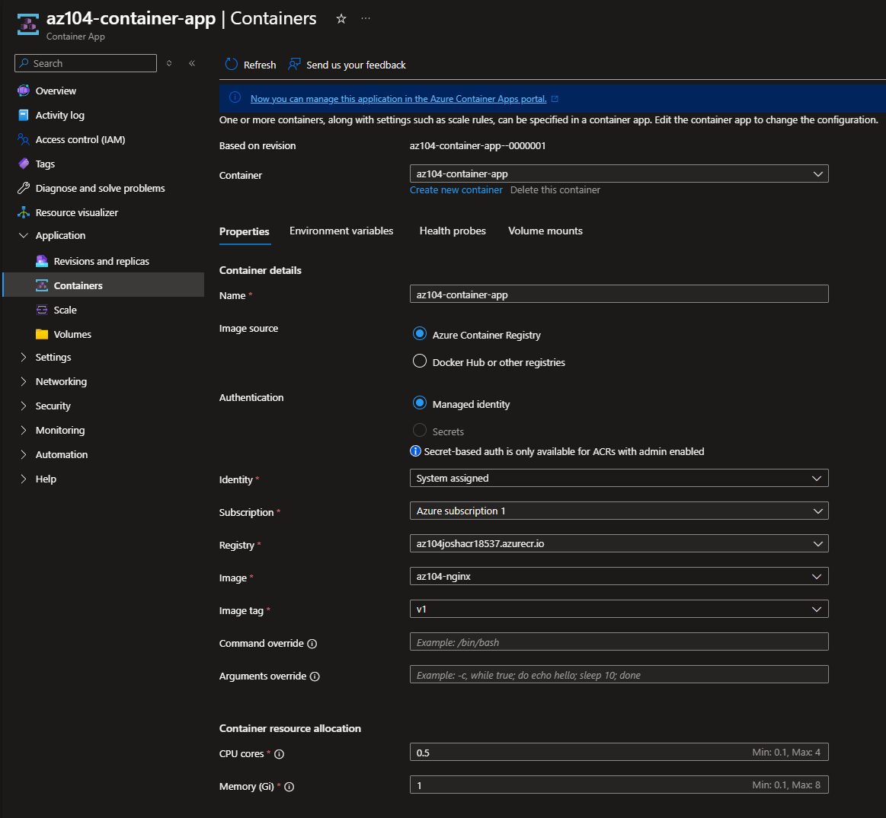
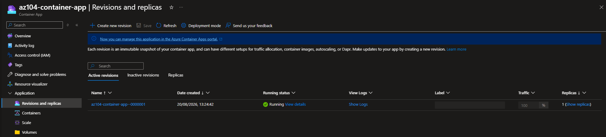
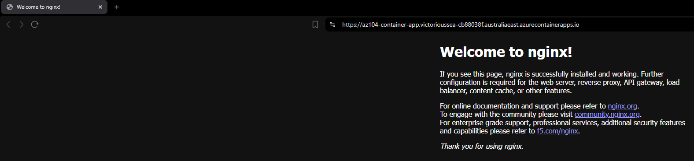
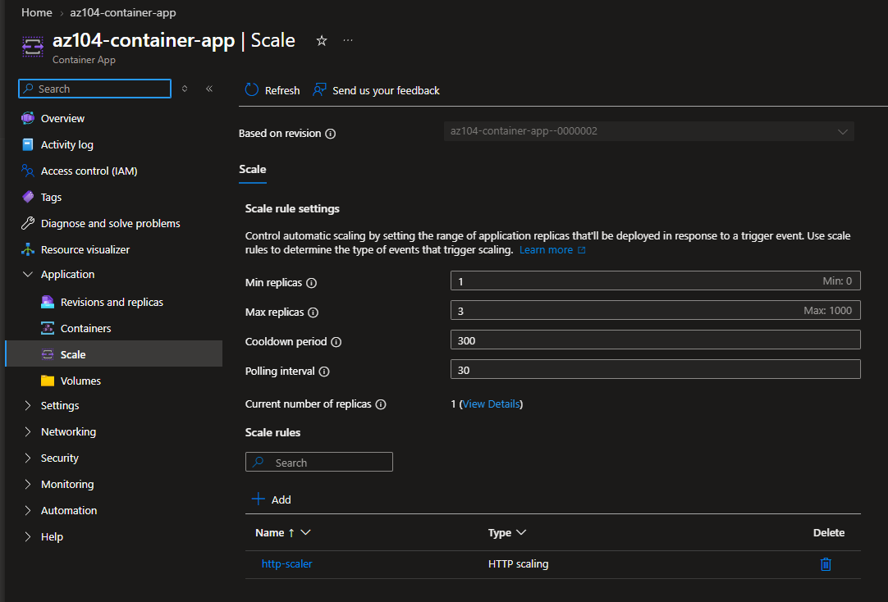

# Configuration 08 — Azure Containers

## Configuration Overview

This configuration demonstrates Azure container deployment and management using **Azure Container Registry (ACR)**, **Azure Container Instances (ACI)**, **Azure Container Apps**, managed identities, and Azure RBAC.

The environment was first implemented and validated through the Azure Portal, then recreated with Terraform as Infrastructure as Code.

## Architecture

```text
Container Image
   ↓
Azure Container Registry
   ↓
Managed Identity + AcrPull
   ↓
├── Azure Container Instance
└── Azure Container App
       ↓
   External Ingress
       ↓
   Public Workload
```

## What I Configured

### Azure Container Registry

Created a private Azure Container Registry and stored the container image as:

```text
az104-nginx:v1
```

The image was validated in ACR before being deployed to Azure container services.

### Azure Container Instances

Deployed a Linux container using Azure Container Instances with:

- Private ACR image
- Public IP address
- Public DNS endpoint
- TCP port 80

The container successfully reached the **Running** state.

### Azure Container Apps

Deployed the private ACR image using Azure Container Apps.

Configured:

- External ingress
- Managed identity authentication
- `AcrPull` RBAC access
- Active revisions
- Minimum replicas: 1
- Maximum replicas: 3
- HTTP-based scaling

The Nginx workload was successfully accessed through the public Container Apps endpoint.

### Managed Identity and ACR Access

Configured managed identity with the built-in `AcrPull` role so the Container App could retrieve the private image from Azure Container Registry without storing registry credentials in the application configuration.

## Terraform Implementation

The core container architecture was recreated with Terraform.

Terraform managed **8 Azure resources**:

- 1 resource group
- 1 Azure Container Registry
- 1 user-assigned managed identity
- 1 `AcrPull` role assignment
- 1 Log Analytics workspace
- 1 Container Apps environment
- 1 Azure Container Instance
- 1 Azure Container App

The Terraform deployment included:

- Private ACR image deployment
- Managed identity authentication
- External ingress
- HTTPS public access
- Single revision mode
- Minimum replicas: 1
- Maximum replicas: 3
- HTTP-based scaling

A final Terraform plan reported:

```text
No changes. Your infrastructure matches the configuration.
```

This confirmed that the deployed environment matched the Terraform configuration.

### Terraform Files

```text
terraform/
├── .terraform.lock.hcl
├── main.tf
├── outputs.tf
├── providers.tf
├── variables.tf
└── versions.tf
```

## Security and Repository Practices

- Azure Container Registry was used as the private image repository.
- Managed identities were used for credential-free ACR authentication.
- The `AcrPull` role provided least-privilege access to container images.
- Registry credentials were not embedded in the Container App configuration.
- Terraform state, plan, and working-directory files were excluded from source control.
- Subscription IDs, passwords, access keys, and authentication tokens were excluded from public evidence.
- Temporary Azure resources were removed after validation to control costs.

## Evidence

### Azure Container Registry Image



### Azure Container Instance Running



### Azure Container App Running



### Private ACR Image and Managed Identity



### Active Container App Revision



### Public Nginx Workload



### Container App Scaling



## Skills Demonstrated

- Azure Container Registry
- Azure Container Instances
- Azure Container Apps
- Private container image management
- Managed identities
- Azure RBAC
- `AcrPull`
- Container App environments
- External ingress
- Container App revisions
- Replica management
- HTTP-based scaling
- Log Analytics integration
- Terraform Infrastructure as Code
- Terraform state and drift validation
- Azure resource cleanup

## Outcome

This configuration demonstrated an end-to-end Azure container workflow from private image storage through container deployment, identity-based registry access, public workload validation, revisions, and scaling.

The same core architecture was then reproduced with Terraform using managed identity and RBAC for private ACR access, with the final deployment validated through a no-drift Terraform plan.