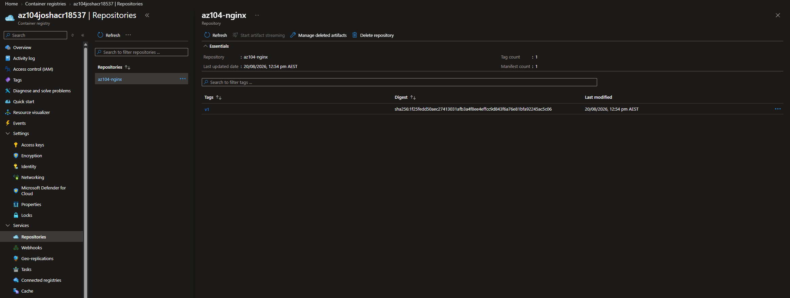
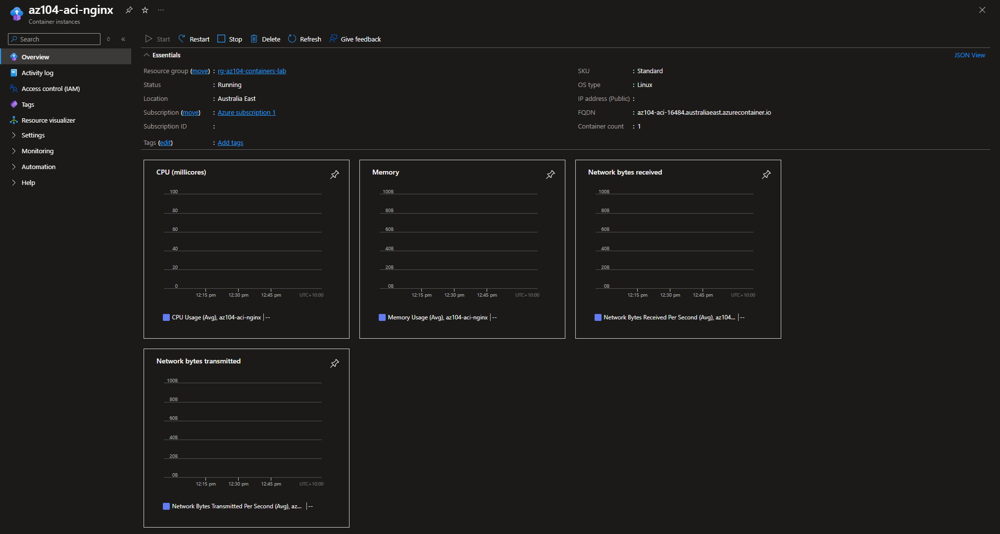
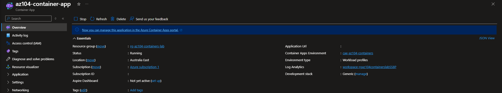
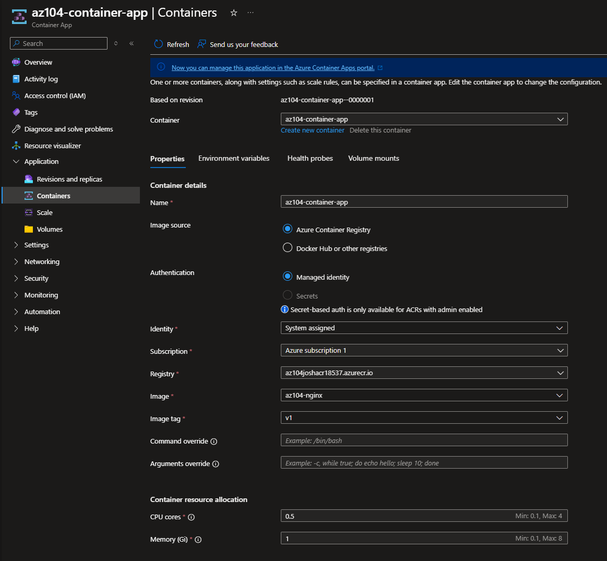
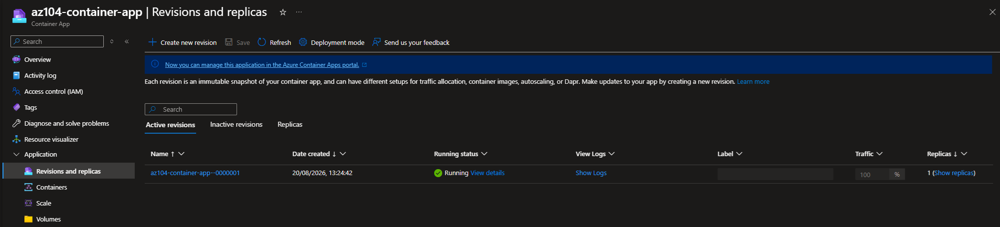
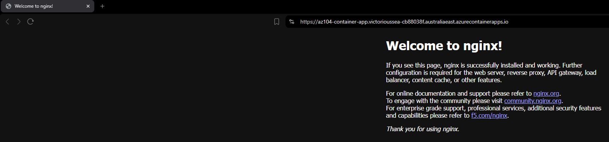
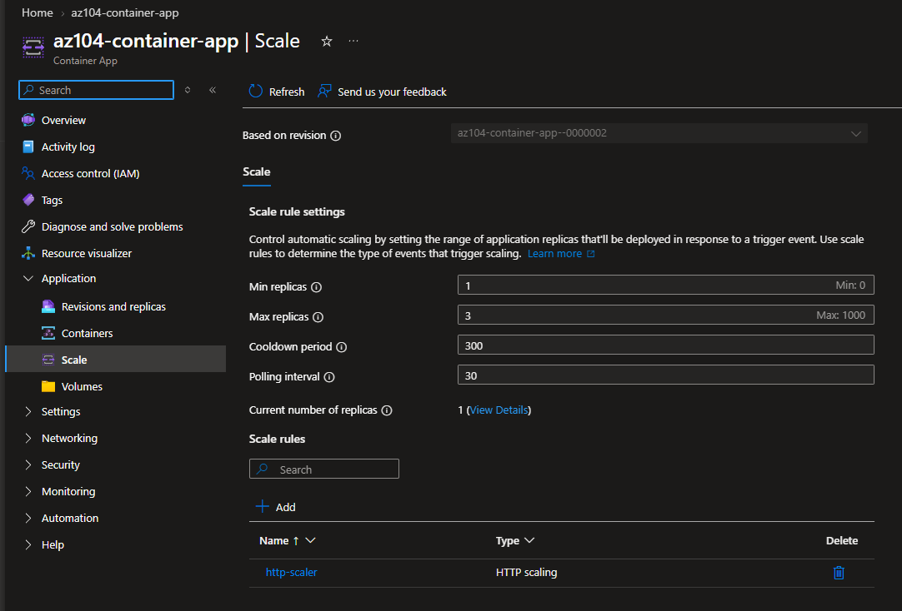

# Azure Container Registry, ACI and Container Apps

## Overview

I built and validated an Azure container workflow using Azure Container Registry (ACR), Azure Container Instances (ACI) and Azure Container Apps.

The lab covered private image storage, managed identity-based registry access, public workload deployment, revisions, ingress and scaling. The core architecture was then recreated with Terraform.

## Architecture

```text
Container Image
   ↓
Azure Container Registry
   ↓
Managed Identity + AcrPull
   ↓
├── Azure Container Instance
└── Azure Container App
       ↓
   External Ingress
       ↓
   Public Workload
```

## What I Configured

### Azure Container Registry

Created a private Azure Container Registry and stored the container image as:

```text
az104-nginx:v1
```

The image was validated in ACR before being deployed to Azure container services.

### Azure Container Instances

Deployed a Linux container with Azure Container Instances using:

- Private ACR image
- Public IP address
- Public DNS endpoint
- TCP port 80

The container successfully reached the **Running** state.

### Azure Container Apps

Deployed the private ACR image using Azure Container Apps.

Configured:

- External ingress
- Managed identity authentication
- `AcrPull` RBAC access
- Single revision mode
- Minimum replicas: 1
- Maximum replicas: 3
- HTTP-based scaling

The Nginx workload was successfully accessed through the public Container Apps endpoint.

### Managed Identity and ACR Access

Configured a user-assigned managed identity with the built-in `AcrPull` role so both Azure Container Instances and Azure Container Apps could retrieve the private image from Azure Container Registry without storing registry credentials in the workload configuration.

## Terraform Implementation

The core container architecture was recreated with Terraform.

Terraform defines **8 Azure resources**:

- 1 resource group
- 1 Azure Container Registry
- 1 user-assigned managed identity
- 1 `AcrPull` role assignment
- 1 Log Analytics workspace
- 1 Container Apps environment
- 1 Azure Container Instance
- 1 Azure Container App

The Terraform configuration includes:

- Private ACR image deployment
- User-assigned managed identity authentication
- `AcrPull` RBAC access
- Public ACI endpoint
- External Container App ingress
- HTTPS-only public Container App access
- Single revision mode
- Minimum replicas: 1
- Maximum replicas: 3
- HTTP-based scaling
- Log Analytics integration

A final Terraform plan reported:

```text
No changes. Your infrastructure matches the configuration.
```

This confirmed that the deployed environment matched the Terraform configuration.

### Terraform Files

```text
terraform/
├── .terraform.lock.hcl
├── main.tf
├── outputs.tf
├── providers.tf
├── variables.tf
└── versions.tf
```

## Security and Repository Practices

- Azure Container Registry was used as the private image repository
- ACR admin authentication was disabled in Terraform
- A user-assigned managed identity was used for registry authentication
- The built-in `AcrPull` role limited the identity to image-pull access
- Registry usernames and passwords were not embedded in the container configuration
- Insecure HTTP access was disabled for the public Container App endpoint
- Terraform state, plan and working-directory files were excluded from source control
- Subscription IDs, passwords, access keys and authentication tokens were excluded from public evidence
- Temporary Azure resources were removed after validation to control costs

## Evidence

### Azure Container Registry Image



### Azure Container Instance Running



### Azure Container App Running



### Private ACR Image and Managed Identity



### Active Container App Revision



### Public Nginx Workload



### Container App Scaling



## Key Skills

- Azure Container Registry
- Azure Container Instances
- Azure Container Apps
- Private container image management
- Managed identities
- Azure RBAC
- `AcrPull`
- Container Apps environments
- External ingress
- Container App revisions
- Replica management
- HTTP-based scaling
- Log Analytics integration
- Terraform Infrastructure as Code
- Terraform state and no-drift validation
- Azure resource cleanup

## Result

Validated an end-to-end Azure container workflow from private image storage through identity-based image retrieval, container deployment, public workload access, revisions and scaling.

The same core architecture was reproduced with Terraform using managed identity and Azure RBAC for private ACR access, with the deployment validated through a no-drift plan.