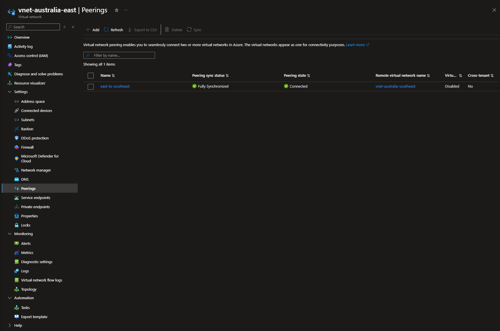
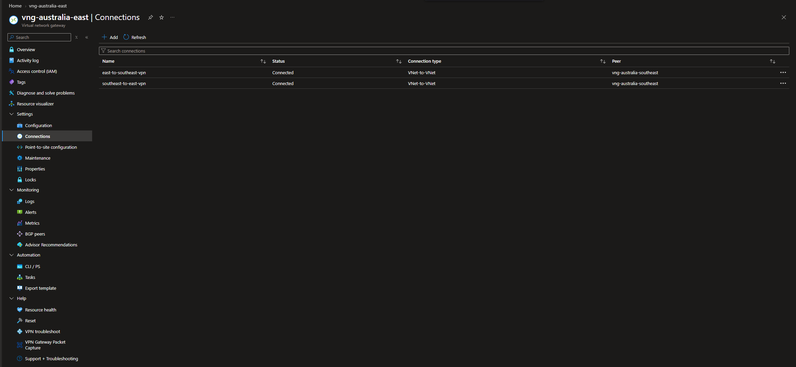
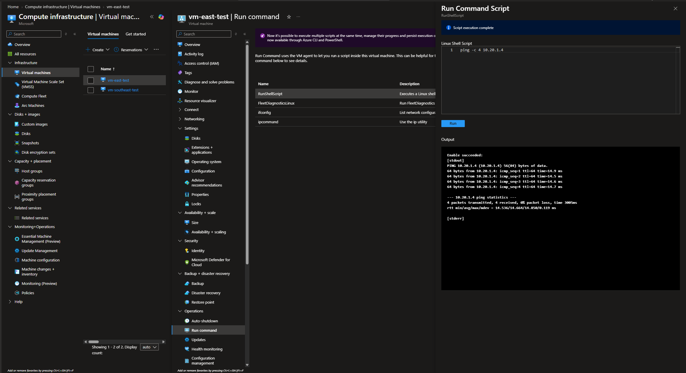
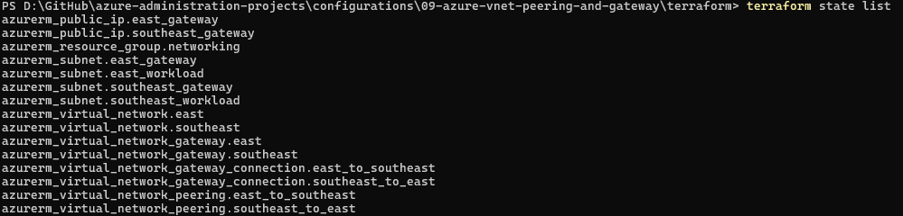

# Configuration 09 — Azure VNet Peering and Gateway

## Configuration Overview

This configuration demonstrates cross-region Azure virtual network connectivity using both **Global VNet Peering** and a **VNet-to-VNet VPN Gateway connection**.

The environment was first built and validated through the Azure Portal, then recreated with Terraform as Infrastructure as Code.

## Architecture

```text
Australia East                             Australia Southeast
10.10.0.0/16                               10.20.0.0/16
┌──────────────────────┐                   ┌──────────────────────┐
│ vnet-australia-east  │                   │ vnet-australia-      │
│                      │                   │ southeast            │
│ snet-workload        │                   │ snet-workload        │
│ 10.10.1.0/24         │                   │ 10.20.1.0/24         │
│                      │                   │                      │
│ GatewaySubnet        │                   │ GatewaySubnet        │
│ 10.10.255.0/27       │                   │ 10.20.255.0/27       │
└──────────┬───────────┘                   └──────────┬───────────┘
           │                                          │
           │            Global VNet Peering           │
           ├──────────────────────────────────────────┤
           │                                          │
           │       VNet-to-VNet VPN Connection        │
           └────────────── VPN Gateways ──────────────┘
```

## What I Configured

### Cross-Region Virtual Networks

Created two Azure virtual networks in separate regions:

- **Australia East:** `10.10.0.0/16`
- **Australia Southeast:** `10.20.0.0/16`

Each VNet included:

- a workload subnet
- a dedicated `GatewaySubnet`

The address spaces were intentionally non-overlapping so the networks could communicate through peering and VPN routing.

### Global VNet Peering

Configured bidirectional peering between the two VNets.

The peering reached:

- **Connected**
- **Fully Synchronized**

This demonstrated private Azure backbone connectivity between VNets in different Azure regions.

### Virtual Network Gateways

Deployed a VPN gateway in each VNet using:

- Gateway type: **VPN**
- VPN type: **Route-based**
- SKU: **VpnGw1AZ**
- BGP: **Disabled**
- Active-active mode: **Disabled**
- Standard static public IP addresses

Dedicated `/27` `GatewaySubnet` ranges were used for both gateways.

### VNet-to-VNet VPN

Created bidirectional VNet-to-VNet VPN connections between the gateways:

- `east-to-southeast-vpn`
- `southeast-to-east-vpn`

Both connections reached **Connected** status.

### Private Connectivity Validation

To prove traffic could traverse the VPN rather than the peering path, the VNet peering was removed before the final connectivity test.

A small Linux VM was placed in each workload subnet with **no public IP address**.

From the Australia East VM, I tested the private address of the Australia Southeast VM:

```text
4 packets transmitted, 4 received, 0% packet loss
```

This validated private cross-region connectivity through the VNet-to-VNet VPN.

## Terraform Implementation

The same network architecture was recreated with Terraform using the AzureRM provider.

Terraform managed **15 Azure resources**:

- 1 resource group
- 2 virtual networks
- 4 subnets
- 2 VNet peerings
- 2 Standard public IP addresses
- 2 Virtual Network Gateways
- 2 VNet-to-VNet VPN connections

The final Terraform deployment completed successfully, both VPN connections reached **Connected / Succeeded**, and a final `terraform plan` confirmed **no configuration drift**.

### Terraform Files

```text
terraform/
├── .terraform.lock.hcl
├── main.tf
├── outputs.tf
├── providers.tf
├── variables.tf
└── versions.tf
```

The VPN pre-shared key was supplied as a sensitive Terraform variable and was not stored in the repository.

## Troubleshooting and Findings

During the Terraform deployment, I resolved two Azure networking issues:

- AzureRM v5 uses `bgp_enabled` rather than the older `enable_bgp` argument.
- `VpnGw1AZ` public IP requirements differ by region. Australia East supports availability zones, while Australia Southeast does not, so the public IP configuration had to reflect each region's capabilities.

These issues were resolved without rebuilding the entire environment from scratch by allowing Terraform to reconcile the partially deployed state.

## Security Considerations

- Test VMs had **no public IP addresses**.
- No public inbound ports were opened for connectivity validation.
- VPN connectivity used a temporary pre-shared key that was not committed to Git.
- Saved Terraform plan files containing sensitive values were removed.
- Test resources were destroyed after validation to reduce unnecessary Azure cost.

## Evidence

### Global VNet Peering



Cross-region VNet peering reached **Connected** and **Fully Synchronized** state.

### VNet-to-VNet VPN



Both VPN gateway connection objects reached **Connected** status.

### Private Connectivity Validation



Private traffic successfully crossed the VPN with **0% packet loss** after the VNet peering path was removed.

### Terraform-Managed Resources



Terraform state showed the full set of managed networking resources.

## Skills Demonstrated

- Azure Virtual Networks and subnets
- Cross-region VNet design
- Global VNet Peering
- Azure VPN Gateway
- VNet-to-VNet VPN connectivity
- GatewaySubnet planning
- Private IP connectivity validation
- Azure routing and connectivity troubleshooting
- Terraform Infrastructure as Code
- Terraform state and drift validation
- Azure cost-conscious resource cleanup

## Outcome

This configuration demonstrated two different methods for connecting Azure virtual networks across regions and validated the resulting private connectivity.

It also showed the ability to reproduce the same architecture with Terraform, troubleshoot provider and regional platform differences, verify state convergence, and clean up temporary cloud resources after testing.
