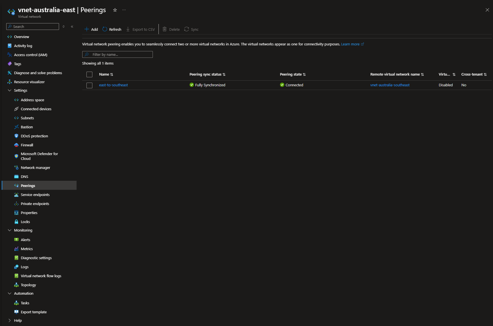
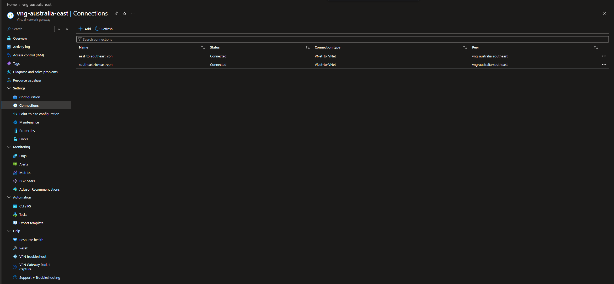
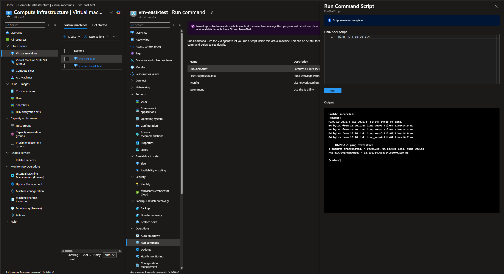
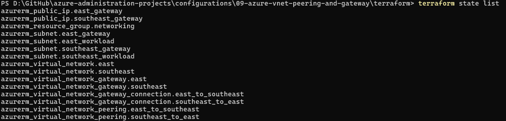

# Cross-Region VNet Peering and VPN Gateway

## Overview

I built and validated cross-region Azure virtual network connectivity using both **Global VNet Peering** and a **VNet-to-VNet VPN Gateway connection**.

The environment connected workloads in Australia East and Australia Southeast, then reproduced the network architecture with Terraform.

## Architecture

```text
Australia East                             Australia Southeast
10.10.0.0/16                               10.20.0.0/16
┌──────────────────────┐                   ┌──────────────────────┐
│ vnet-australia-east  │                   │ vnet-australia-      │
│                      │                   │ southeast            │
│ snet-workload        │                   │ snet-workload        │
│ 10.10.1.0/24         │                   │ 10.20.1.0/24         │
│                      │                   │                      │
│ GatewaySubnet        │                   │ GatewaySubnet        │
│ 10.10.255.0/27       │                   │ 10.20.255.0/27       │
└──────────┬───────────┘                   └──────────┬───────────┘
           │                                          │
           │            Global VNet Peering           │
           ├──────────────────────────────────────────┤
           │                                          │
           │       VNet-to-VNet VPN Connection        │
           └────────────── VPN Gateways ──────────────┘
```

## What I Configured

### Cross-Region Virtual Networks

Created two Azure virtual networks in separate regions:

- **Australia East:** `10.10.0.0/16`
- **Australia Southeast:** `10.20.0.0/16`

Each VNet included:

- A workload subnet
- A dedicated `GatewaySubnet`

The address spaces were intentionally non-overlapping to support peering and VPN routing.

### Global VNet Peering

Configured bidirectional peering between the two VNets.

The peering reached:

- **Connected**
- **Fully Synchronized**

This provided private cross-region connectivity over the Azure backbone.

### Virtual Network Gateways

Deployed a VPN gateway in each VNet using:

- Gateway type: **VPN**
- VPN type: **Route-based**
- SKU: **VpnGw1AZ**
- BGP: **Disabled**
- Active-active mode: **Disabled**
- Standard static public IP addresses

Dedicated `/27` `GatewaySubnet` ranges were used for both gateways.

### VNet-to-VNet VPN

Created VNet-to-VNet VPN connections between the gateways:

- `east-to-southeast-vpn`
- `southeast-to-east-vpn`

Both connections reached **Connected** status.

### Private Connectivity Validation

To ensure the final connectivity test used the VPN path rather than peering, I removed the VNet peering before testing.

A small Linux VM was placed in each workload subnet with **no public IP address**.

From the Australia East VM, I tested the private address of the Australia Southeast VM:

```text
4 packets transmitted, 4 received, 0% packet loss
```

This validated private cross-region connectivity through the VNet-to-VNet VPN.

## Terraform Implementation

The same network architecture was recreated with Terraform using the AzureRM provider.

Terraform defines **15 Azure resources**:

- 1 resource group
- 2 virtual networks
- 4 subnets
- 2 VNet peerings
- 2 Standard public IP addresses
- 2 Virtual Network Gateways
- 2 VNet-to-VNet VPN connections

The Terraform deployment completed successfully, both VPN connections reached **Connected / Succeeded**, and the final plan reported no configuration drift.

### Terraform Files

```text
terraform/
├── .terraform.lock.hcl
├── main.tf
├── providers.tf
├── variables.tf
└── versions.tf
```

The VPN pre-shared key is supplied through a sensitive Terraform variable and is not stored in the repository.

## Troubleshooting and Findings

During deployment, I resolved two Azure networking issues:

- AzureRM v5 uses `bgp_enabled` for the VPN gateway and connection configuration
- Availability Zone support differs between Australia East and Australia Southeast, so the public IP zone configuration had to match each region's capabilities

Terraform was then used to reconcile the partially deployed environment without rebuilding the entire configuration from scratch.

## Security and Repository Practices

- Test VMs had **no public IP addresses**
- No public inbound ports were opened for the private connectivity validation
- The VPN pre-shared key was supplied as a sensitive Terraform variable and not committed to Git
- Saved Terraform plan files containing sensitive values were excluded from source control
- Terraform state and working-directory files were excluded from source control
- Temporary Azure resources were destroyed after validation to reduce unnecessary cost

## Evidence

### Global VNet Peering



Cross-region VNet peering reached **Connected** and **Fully Synchronized** state.

### VNet-to-VNet VPN



Both VPN gateway connection objects reached **Connected** status.

### Private Connectivity Validation



Private traffic successfully crossed the VPN with **0% packet loss** after the peering path was removed.

### Terraform-Managed Resources



Terraform state showed the complete set of managed networking resources.

## Key Skills

- Azure Virtual Networks and subnets
- Cross-region VNet design
- Global VNet Peering
- Azure VPN Gateway
- VNet-to-VNet VPN connectivity
- GatewaySubnet planning
- Private IP connectivity validation
- Azure routing and connectivity troubleshooting
- Terraform Infrastructure as Code
- Terraform state and no-drift validation
- Azure resource cleanup and cost control

## Result

Validated two methods for connecting Azure virtual networks across regions and confirmed private workload connectivity through the VNet-to-VNet VPN.

The same network architecture was reproduced with Terraform, including regional handling for VPN gateway public IP configuration, state reconciliation and final no-drift validation.