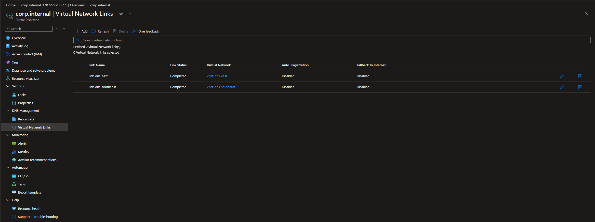
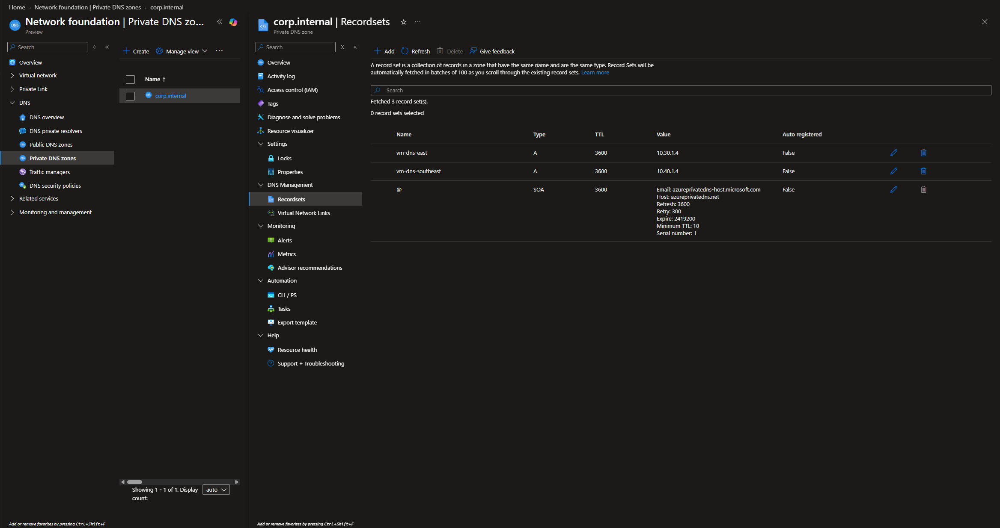
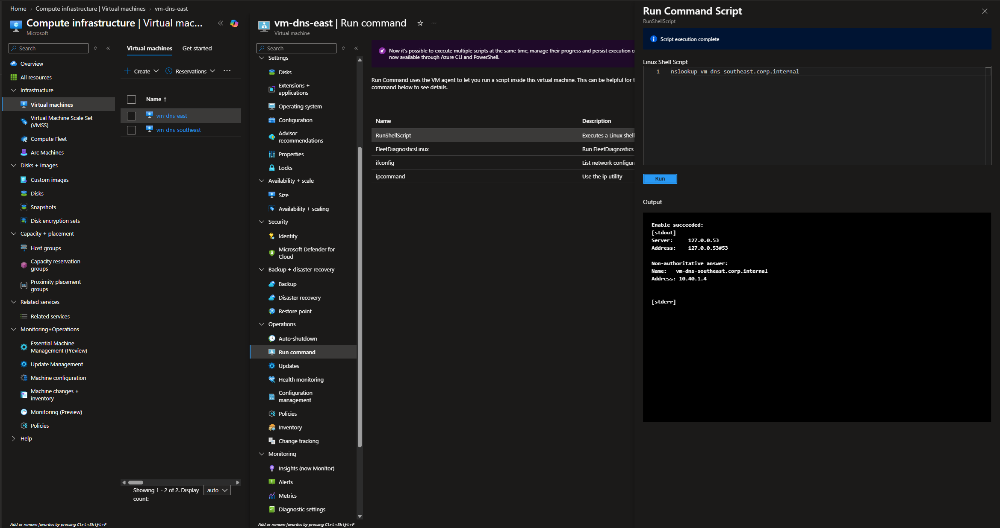
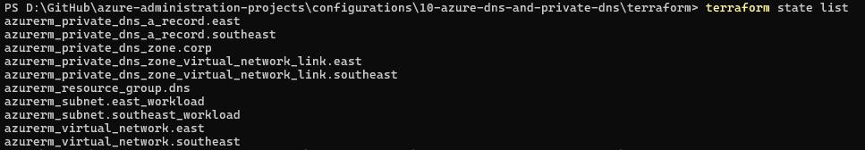

# Configuration 10 — Azure DNS and Private DNS

## Configuration Overview

This configuration demonstrates private DNS name resolution across Azure virtual networks using **Azure Private DNS**.

The environment was first built and validated through the Azure Portal, then recreated with Terraform as Infrastructure as Code.

## Architecture

```text
Australia East                             Australia Southeast
10.30.0.0/16                               10.40.0.0/16
┌──────────────────────┐                   ┌──────────────────────┐
│ vnet-dns-east        │                   │ vnet-dns-southeast   │
│                      │                   │                      │
│ snet-workload        │                   │ snet-workload        │
│ 10.30.1.0/24         │                   │ 10.40.1.0/24         │
│                      │                   │                      │
│ vm-dns-east          │                   │ vm-dns-southeast     │
│ 10.30.1.4            │                   │ 10.40.1.4            │
└──────────┬───────────┘                   └──────────┬───────────┘
           │                                          │
           └──────────────┬───────────────────────────┘
                          │
                 Azure Private DNS
                    corp.internal
                          │
              ┌───────────┴───────────┐
              │                       │
 vm-dns-east.corp.internal   vm-dns-southeast.corp.internal
        10.30.1.4                    10.40.1.4
```

## What I Configured

### Virtual Networks

Created two non-overlapping Azure virtual networks:

- **Australia East:** `10.30.0.0/16`
- **Australia Southeast:** `10.40.0.0/16`

Each VNet contains a dedicated workload subnet:

- `10.30.1.0/24`
- `10.40.1.0/24`

### Azure Private DNS Zone

Created the Private DNS zone:

```text
corp.internal
```

The zone was linked to both VNets with auto-registration disabled so DNS records could be managed explicitly.

### Private DNS VNet Links

Configured:

- `link-dns-east`
- `link-dns-southeast`

Both links completed successfully and allowed resources in each linked VNet to query the same private DNS namespace.

### Private DNS A Records

Created manual A records:

```text
vm-dns-east.corp.internal       → 10.30.1.4
vm-dns-southeast.corp.internal  → 10.40.1.4
```

Both records use a TTL of `3600` seconds.

### DNS Resolution Validation

Created one Linux test VM in each VNet with no public IP address.

From `vm-dns-east`, the following query successfully resolved the Southeast VM:

```text
nslookup vm-dns-southeast.corp.internal
```

Result:

```text
Name:    vm-dns-southeast.corp.internal
Address: 10.40.1.4
```

The reverse lookup from `vm-dns-southeast` also resolved:

```text
vm-dns-east.corp.internal → 10.30.1.4
```

This validated Private DNS resolution from both linked virtual networks.

## Terraform Implementation

The same DNS architecture was recreated with Terraform using the AzureRM provider.

Terraform managed **10 Azure resources**:

- 1 resource group
- 2 virtual networks
- 2 subnets
- 1 Private DNS zone
- 2 Private DNS VNet links
- 2 Private DNS A records

The deployment completed successfully and a final `terraform plan` confirmed:

```text
No changes. Your infrastructure matches the configuration.
```

### Terraform Files

```text
terraform/
├── .terraform.lock.hcl
├── main.tf
├── outputs.tf
├── providers.tf
├── variables.tf
└── versions.tf
```

## Troubleshooting and Findings

During the Terraform recreation, AzureRM v5 required the newer `private_dns_zone_id` argument for Private DNS VNet links and A records.

The configuration was updated to use resource IDs rather than the older `resource_group_name` and `zone_name` style arguments.

## Security Considerations

- Test VMs had **no public IP addresses**.
- No public inbound ports were opened.
- DNS records used private RFC1918 addresses only.
- Terraform state and runtime files were excluded from source control.
- Temporary Azure resources were destroyed after validation to control cost.

## Evidence

### Private DNS VNet Links



Both VNets are linked to the `corp.internal` Private DNS zone with successful link status.

### Private DNS A Records



Manual A records map the two VM hostnames to their private IP addresses.

### Private DNS Resolution Validation



`vm-dns-east` successfully resolved `vm-dns-southeast.corp.internal` to `10.40.1.4`.

### Terraform-Managed Resources



Terraform state shows the complete set of 10 managed DNS and networking resources.

## Skills Demonstrated

- Azure Private DNS
- Private DNS zones
- Private DNS A records
- Virtual network links
- Azure virtual networks and subnets
- Private hostname resolution
- Linux `nslookup`
- Azure Portal validation
- Terraform Infrastructure as Code
- Terraform state and drift validation
- AzureRM provider troubleshooting
- Cost-conscious Azure cleanup

## Outcome

This configuration demonstrated how Azure Private DNS can provide a shared private namespace across multiple linked virtual networks.

It also showed the ability to reproduce the DNS architecture with Terraform, validate the resulting state with no drift, and clean up temporary cloud resources after testing.
