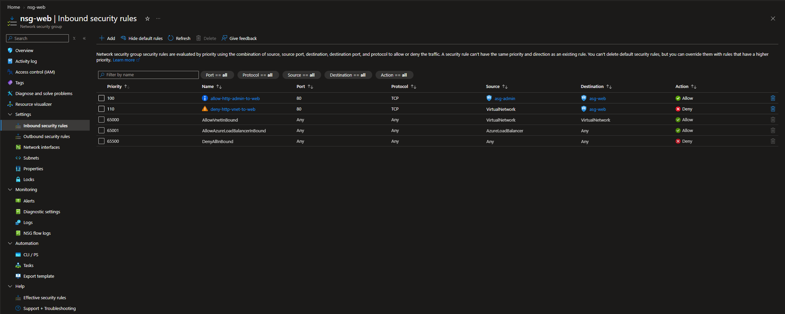
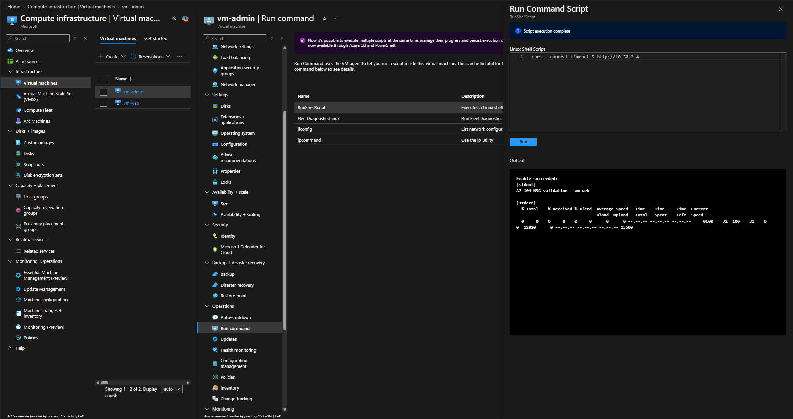
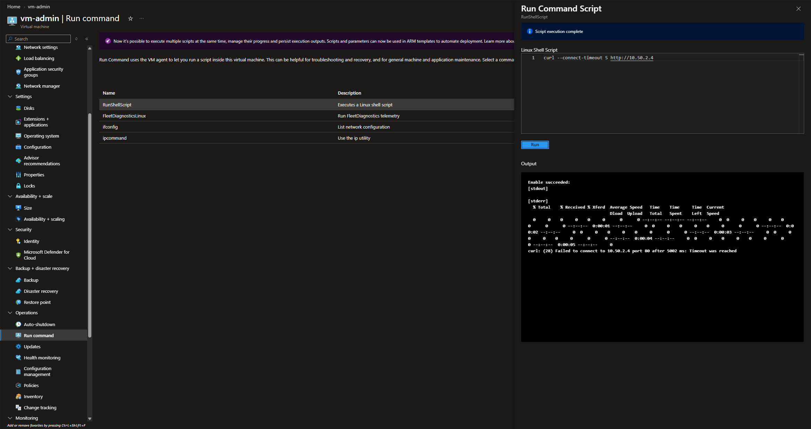
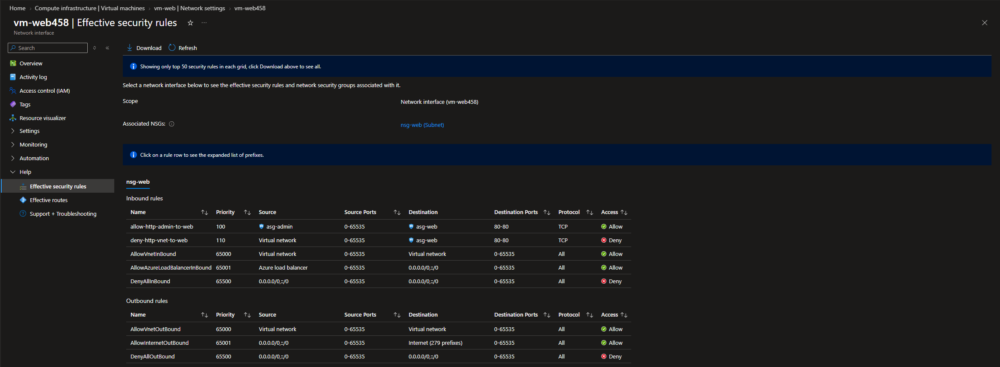
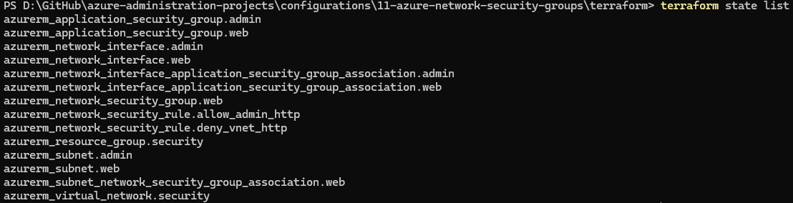

# Configuration 11 — Azure Network Security Groups

## Configuration Overview

This configuration demonstrates Azure network traffic filtering using **Network Security Groups (NSGs)** and **Application Security Groups (ASGs)**.

The environment was first built and validated through the Azure Portal, then recreated with Terraform as Infrastructure as Code.

## Architecture

```text
vnet-security-lab
10.50.0.0/16

├── snet-admin
│   └── vm-admin
│       └── asg-admin
│
└── snet-web
    └── vm-web
        └── asg-web
        └── nsg-web
            ├── Priority 100
            │   Allow TCP/80
            │   asg-admin → asg-web
            │
            └── Priority 110
                Deny TCP/80
                VirtualNetwork → asg-web
```

## What I Configured

### Virtual Network Segmentation

Created an Azure virtual network with two workload subnets:

- `snet-admin` — `10.50.1.0/24`
- `snet-web` — `10.50.2.0/24`

The separation allowed the admin and web workloads to be grouped independently for security-rule testing.

### Application Security Groups

Created two Application Security Groups:

- `asg-admin`
- `asg-web`

The `vm-admin` network interface was associated with `asg-admin`, while the `vm-web` network interface was associated with `asg-web`.

This allowed NSG rules to reference logical application roles instead of hard-coded IP addresses.

### Network Security Group

Created `nsg-web` and associated it with the `snet-web` subnet.

Two custom inbound rules were configured:

```text
Priority 100
allow-http-admin-to-web
TCP/80
asg-admin → asg-web
Allow
```

```text
Priority 110
deny-http-vnet-to-web
TCP/80
VirtualNetwork → asg-web
Deny
```

Because Azure evaluates NSG rules in priority order, the lower-priority-number Allow rule is evaluated before the broader Deny rule.

### Allow Rule Validation

A lightweight HTTP service was started on `vm-web`.

From `vm-admin`, an HTTP request to the private IP of `vm-web` succeeded while `vm-admin` was a member of `asg-admin`.

This validated the priority-100 rule:

```text
asg-admin → asg-web
TCP/80
Allow
```

### Deny Rule Validation

`vm-admin` was temporarily removed from `asg-admin` and the same HTTP request was repeated.

The request timed out, confirming that the priority-100 Allow rule no longer matched and that the priority-110 rule blocked the traffic:

```text
VirtualNetwork → asg-web
TCP/80
Deny
```

The original `asg-admin` membership was then restored.

### Effective Security Rules

The effective security rules for the `vm-web` network interface were reviewed in the Azure Portal.

The calculated rule set showed:

- priority `100` — `allow-http-admin-to-web`
- priority `110` — `deny-http-vnet-to-web`
- Azure default inbound rules including `AllowVnetInBound`, `AllowAzureLoadBalancerInBound` and `DenyAllInBound`

This confirmed the final NSG rules applying to the web workload through its subnet.

## Terraform Implementation

The security architecture was recreated with Terraform using the AzureRM provider.

Terraform managed **14 Azure resources**:

- 1 resource group
- 1 virtual network
- 2 subnets
- 2 Application Security Groups
- 1 Network Security Group
- 2 NSG security rules
- 1 subnet-to-NSG association
- 2 network interfaces
- 2 NIC-to-ASG associations

The Terraform version intentionally used lightweight network interfaces instead of recreating the two VMs because the runtime allow/deny behaviour had already been validated through the Azure Portal.

A final `terraform plan` confirmed that the Terraform-managed infrastructure matched the configuration with no drift.

### Terraform Files

```text
terraform/
├── .terraform.lock.hcl
├── main.tf
├── outputs.tf
├── providers.tf
├── variables.tf
└── versions.tf
```

## Security Considerations

- Test VMs had no public IP addresses.
- No public inbound ports were opened.
- The NSG was applied at subnet scope to protect the web subnet.
- ASGs were used to reference workload roles rather than fixed private IP addresses.
- A specific Allow rule was placed ahead of a broader Deny rule using explicit priorities.
- Temporary Azure resources were destroyed after validation to control cost.
- Terraform runtime and state files were excluded from source control.

## Evidence

### NSG Priority Rules



The custom priority-100 Allow and priority-110 Deny rules are shown alongside Azure's default inbound rules.

### Allow Validation



`vm-admin` successfully reached the HTTP service on `vm-web` while the admin VM was a member of `asg-admin`.

### Deny Validation



After removing `vm-admin` from `asg-admin`, the same TCP/80 request timed out as expected.

### Effective Security Rules



The effective rules for the `vm-web` network interface show the custom NSG rules and Azure default rules applying to the workload.

### Terraform-Managed Resources



Terraform state shows the full set of 14 managed networking and security resources.

## Skills Demonstrated

- Azure Network Security Groups
- NSG rule priorities
- Application Security Groups
- Subnet-level NSG associations
- Effective security rules
- Private network traffic filtering
- Allow and deny validation
- Azure Virtual Networks and subnets
- Linux HTTP connectivity testing
- Terraform Infrastructure as Code
- Terraform state and drift validation
- Azure security troubleshooting

## Outcome

This configuration demonstrated how Azure NSGs and ASGs can enforce application-aware network segmentation without relying on hard-coded IP addresses.

It also validated how rule priority affects traffic decisions, confirmed the final effective rules applied to a workload, and reproduced the core security architecture with Terraform.