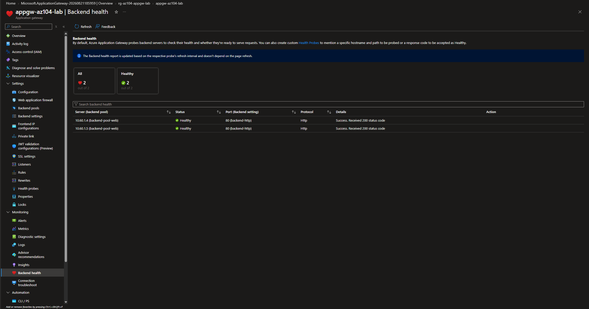
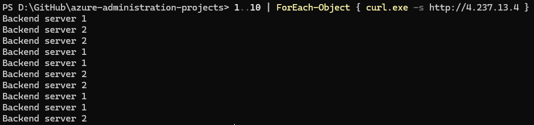
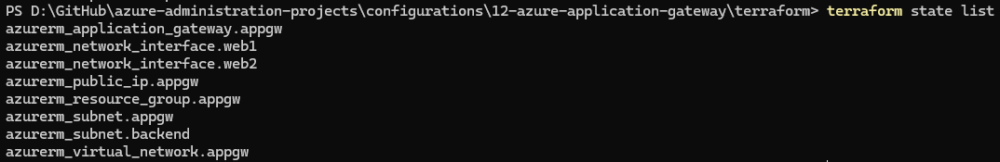

# Configuration 12 — Azure Application Gateway

## Configuration Overview

This configuration demonstrates Layer 7 HTTP load balancing with **Azure Application Gateway**.

The environment was first built and validated through the Azure Portal using two live backend web servers, then recreated with Terraform as Infrastructure as Code.

## Architecture

```text
Internet
   ↓
Public IP
   ↓
Azure Application Gateway
Standard_v2
HTTP listener :80
   ↓
Routing rule
   ↓
Backend HTTP settings :80
   ↓
Backend pool
   ├── vm-web-1
   └── vm-web-2
```

The Application Gateway used a dedicated subnet:

```text
vnet-appgw-lab
10.60.0.0/16

├── snet-appgw
│   └── 10.60.0.0/24
│
└── snet-backend
    └── 10.60.1.0/24
        ├── vm-web-1
        └── vm-web-2
```

## What I Configured

### Application Gateway Network Design

Created a dedicated Application Gateway subnet:

```text
snet-appgw
10.60.0.0/24
```

Backend workloads were isolated in a separate subnet:

```text
snet-backend
10.60.1.0/24
```

### Backend Web Servers

Created two Ubuntu backend VMs with no public IP addresses.

Each VM served a different HTTP response:

```text
vm-web-1 → Backend server 1
vm-web-2 → Backend server 2
```

This made it possible to verify that requests were reaching both backend targets.

### Application Gateway

Configured:

- `Standard_v2` Application Gateway
- Public frontend IP
- HTTP listener on port 80
- Basic routing rule
- Backend pool containing both web VMs
- Backend HTTP settings on port 80
- Autoscaling from 0–2 instances

### Backend Health Validation

Application Gateway Backend Health reported both backend servers as **Healthy**.

Both targets returned successful HTTP 200 responses to the gateway health checks.

### Traffic Distribution Validation

Repeated HTTP requests were sent to the Application Gateway public frontend.

The responses alternated between:

```text
Backend server 1
Backend server 2
```

This confirmed that Application Gateway was distributing HTTP traffic across both healthy backend servers.

## Terraform Implementation

The core Application Gateway architecture was recreated with Terraform using the AzureRM provider.

Terraform managed **8 Azure resources**:

- 1 resource group
- 1 virtual network
- 2 subnets
- 1 Standard public IP address
- 2 backend network interfaces
- 1 Application Gateway

The Terraform version used lightweight backend NICs instead of recreating full VMs because live HTTP traffic distribution had already been validated in the Azure Portal build.

A final `terraform plan` confirmed that the Terraform-managed infrastructure matched the configuration with no drift.

### Terraform Files

```text
terraform/
├── .terraform.lock.hcl
├── main.tf
├── outputs.tf
├── providers.tf
├── variables.tf
└── versions.tf
```

## Security and Design Considerations

- Backend VMs had no public IP addresses.
- Application Gateway used a dedicated subnet.
- Backend workloads were separated into their own subnet.
- Only the Application Gateway frontend was publicly reachable.
- Backend health was validated before traffic testing.
- Temporary Azure resources were destroyed after validation to control cost.
- Terraform runtime and state files were excluded from source control.

## Evidence

### Backend Health



Both backend servers were reported as Healthy and returned HTTP 200 responses.

### Traffic Distribution



Repeated requests to the Application Gateway public IP returned responses from both backend servers.

### Terraform-Managed Resources



Terraform state shows the complete set of 8 managed Application Gateway and networking resources.

## Skills Demonstrated

- Azure Application Gateway
- Layer 7 HTTP load balancing
- Public frontend IP configuration
- HTTP listeners
- Backend pools
- Backend HTTP settings
- Routing rules
- Backend health monitoring
- Traffic distribution validation
- Dedicated Application Gateway subnets
- Azure Virtual Networks and subnets
- Terraform Infrastructure as Code
- Terraform state and drift validation
- Cost-conscious Azure cleanup

## Outcome

This configuration demonstrated how Azure Application Gateway can provide Layer 7 HTTP load balancing across multiple private backend servers.

It also validated backend health, confirmed live traffic distribution across both targets, and reproduced the core gateway architecture with Terraform.
