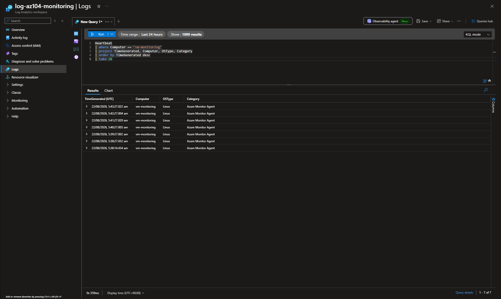
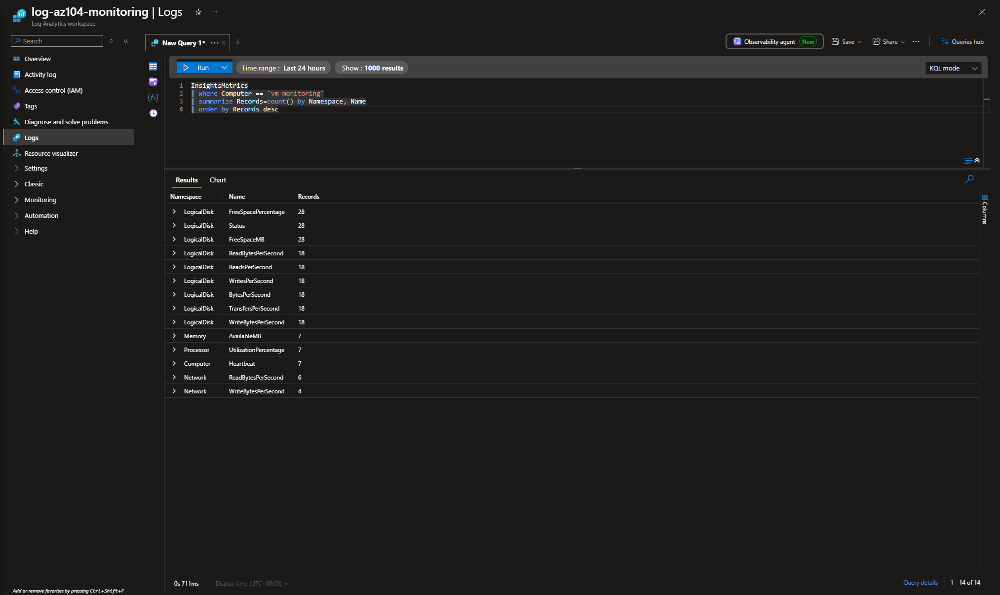
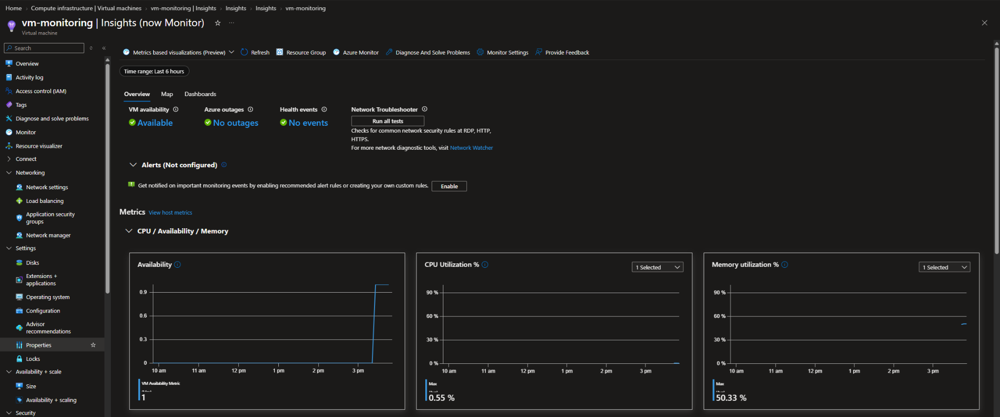
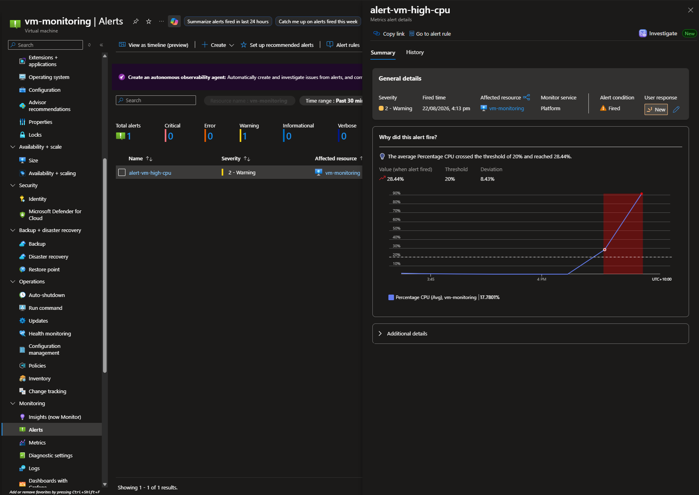
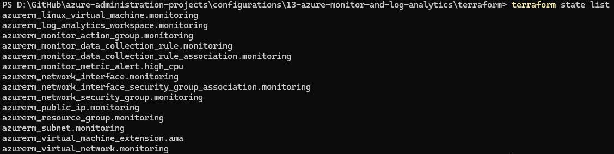

# Configuration 13 — Azure Monitor and Log Analytics

## Configuration Overview

This configuration demonstrates Azure monitoring and observability using **Azure Monitor**, **Log Analytics**, **Azure Monitor Agent**, **Data Collection Rules**, **VM Insights**, **KQL**, and **Azure Monitor alerts**.

The environment was first implemented and validated through the Azure Portal, then recreated with Terraform as Infrastructure as Code.

## Architecture

```text
Ubuntu VM
   ↓
Azure Monitor Agent
   ↓
Data Collection Rule
   ↓
Log Analytics Workspace
   ↓
KQL
├── Heartbeat
└── InsightsMetrics

Azure Monitor
├── VM Insights
├── Action Group
└── Percentage CPU Alert
```

## What I Configured

### Log Analytics and Data Collection

Created a Log Analytics workspace in Australia East and enabled enhanced VM monitoring using:

- Azure Monitor Agent
- OpenTelemetry guest metrics
- Log-based VM metrics
- Data Collection Rule
- Log Analytics integration

### KQL Validation

Validated Azure Monitor Agent connectivity with:

```kusto
Heartbeat
| where Computer == "vm-monitoring"
| project TimeGenerated, Computer, OSType, Category
| order by TimeGenerated desc
| take 20
```

The query returned recent Linux heartbeat records from Azure Monitor Agent.

Validated guest performance telemetry with:

```kusto
InsightsMetrics
| where Computer == "vm-monitoring"
| summarize Records=count() by Namespace, Name
| order by Records desc
```

The results included processor, memory, disk and network metrics.

### VM Insights

VM Insights displayed live availability, CPU, memory, process, disk and network data for the monitored Linux VM.

### Azure Monitor Alert

Created a custom CPU alert with:

```text
Signal: Percentage CPU
Aggregation: Average
Operator: Greater than
Threshold: 20%
Lookback period: 5 minutes
Evaluation frequency: 1 minute
Severity: 2 - Warning
```

An Action Group provided email notification.

CPU load was deliberately generated on the VM. Azure Monitor successfully changed the alert condition to **Fired** after the average CPU crossed the configured threshold.

## Terraform Implementation

The core monitoring architecture was recreated with Terraform.

Terraform managed **14 Azure resources**:

- 1 resource group
- 1 virtual network
- 1 subnet
- 1 Standard public IP address
- 1 network security group
- 1 network interface
- 1 NIC-to-NSG association
- 1 Log Analytics workspace
- 1 Linux virtual machine
- 1 Azure Monitor Agent extension
- 1 Data Collection Rule
- 1 Data Collection Rule association
- 1 Action Group
- 1 CPU metric alert

The VM used a system-assigned managed identity for Azure Monitor Agent. The alert email was supplied through a Terraform environment variable rather than hardcoded into the repository.

A final `terraform plan` confirmed no infrastructure drift.

### Terraform Files

```text
terraform/
├── .terraform.lock.hcl
├── main.tf
├── outputs.tf
├── providers.tf
├── variables.tf
└── versions.tf
```

## Security and Repository Practices

- Public inbound ports were disabled on the monitoring VM.
- An NSG was associated with the VM network interface.
- The alert email was not hardcoded into Terraform files.
- Terraform state, plan and working-directory files were excluded from source control.
- Temporary monitoring resources were destroyed after validation to control cost.
- Auto-created Azure Monitor workspace resources were also removed after the lab.

## Evidence

### Log Analytics Heartbeat Query



### InsightsMetrics Query



### VM Insights Monitoring



### Fired CPU Alert



### Terraform-Managed Resources



## Skills Demonstrated

- Azure Monitor
- Log Analytics
- Azure Monitor Agent
- Data Collection Rules and associations
- VM Insights
- OpenTelemetry guest metrics
- Kusto Query Language (KQL)
- `Heartbeat`
- `InsightsMetrics`
- Azure Monitor metric alerts
- Action Groups
- Alert validation and troubleshooting
- Linux VM monitoring
- Terraform Infrastructure as Code
- Terraform state and drift validation
- Azure cost cleanup

## Outcome

This configuration demonstrated an end-to-end Azure monitoring workflow from telemetry collection through query, visualisation and alerting.

It validated Linux VM heartbeat and guest performance data in Log Analytics, live monitoring through VM Insights, and a custom Azure Monitor alert that successfully fired under generated CPU load. The same core monitoring architecture was then reproduced with Terraform and validated with a no-drift plan.
