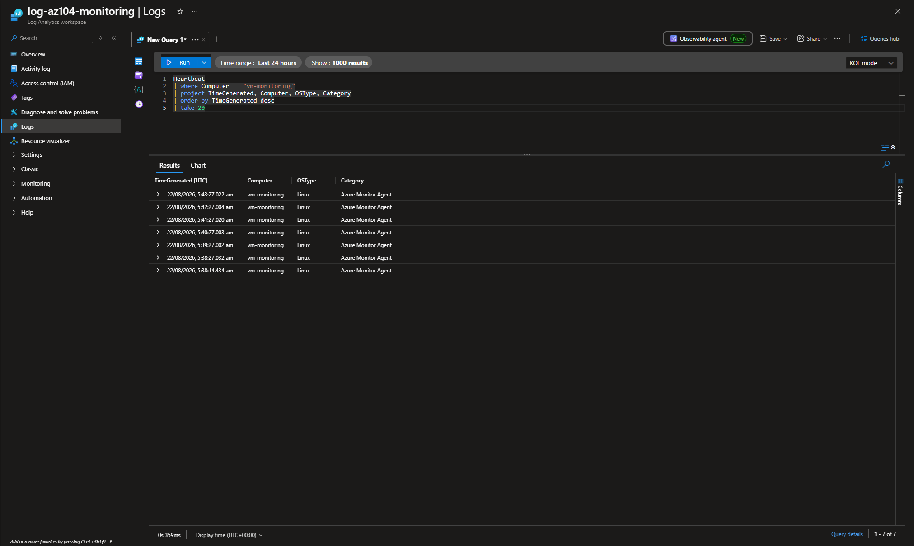
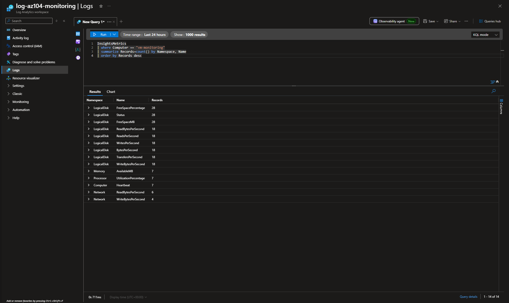
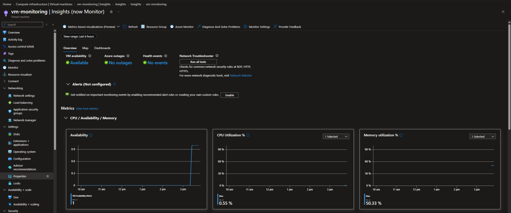
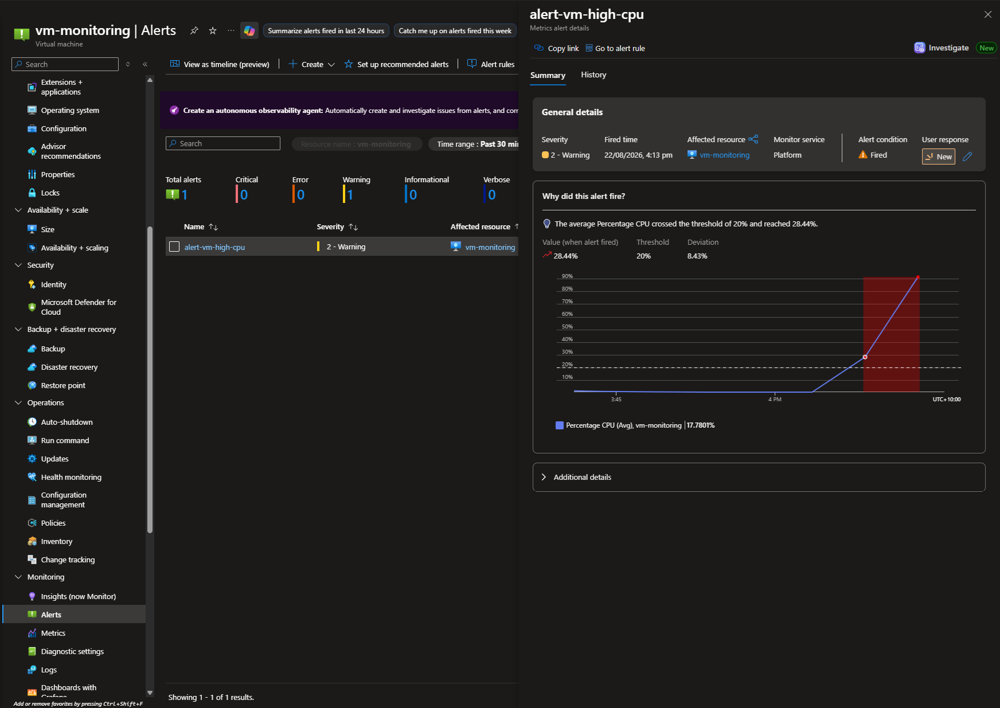
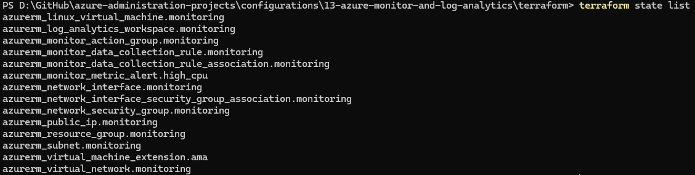

# Azure Monitor, Log Analytics and KQL

## Overview

I built and validated an Azure monitoring workflow using **Azure Monitor**, **Log Analytics**, **Azure Monitor Agent**, **Data Collection Rules**, **VM Insights**, **KQL** and **Azure Monitor alerts**.

The lab covered guest performance collection, log queries, VM monitoring, alerting and notification, then recreated the core monitoring architecture with Terraform.

## Architecture

```text
Ubuntu VM
   ↓
Azure Monitor Agent
   ↓
Data Collection Rule
   ↓
Log Analytics Workspace
   ↓
KQL
├── Heartbeat
└── InsightsMetrics

Azure Monitor
├── VM Insights
├── Action Group
└── Percentage CPU Alert
```

## What I Configured

### Log Analytics and Data Collection

Created a Log Analytics workspace in Australia East and enabled VM monitoring using:

- Azure Monitor Agent
- Data Collection Rule
- Log Analytics integration
- VM Insights
- Guest performance metrics collected into `InsightsMetrics`

### KQL Validation

Validated Azure Monitor Agent connectivity with:

```kusto
Heartbeat
| where Computer == "vm-monitoring"
| project TimeGenerated, Computer, OSType, Category
| order by TimeGenerated desc
| take 20
```

The query returned recent Linux heartbeat records from Azure Monitor Agent.

Validated guest performance telemetry with:

```kusto
InsightsMetrics
| where Computer == "vm-monitoring"
| summarize Records=count() by Namespace, Name
| order by Records desc
```

The results included processor, memory, disk and network metrics.

### VM Insights

VM Insights displayed availability and guest performance data for the monitored Linux VM.

### Azure Monitor Alert

Created a custom CPU alert with:

```text
Signal: Percentage CPU
Aggregation: Average
Operator: Greater than
Threshold: 20%
Lookback period: 5 minutes
Evaluation frequency: 1 minute
Severity: 2 - Warning
```

An Action Group provided email notification.

CPU load was deliberately generated on the VM. Azure Monitor changed the alert condition to **Fired** after the average CPU crossed the configured threshold.

## Terraform Implementation

The core monitoring architecture was recreated with Terraform.

Terraform defines **14 Azure resources**:

- 1 resource group
- 1 virtual network
- 1 subnet
- 1 Standard public IP address
- 1 network security group
- 1 network interface
- 1 NIC-to-NSG association
- 1 Log Analytics workspace
- 1 Linux virtual machine
- 1 Azure Monitor Agent extension
- 1 Data Collection Rule
- 1 Data Collection Rule association
- 1 Action Group
- 1 CPU metric alert

The Linux VM uses a system-assigned managed identity.

The Data Collection Rule sends guest performance data through the `Microsoft-InsightsMetrics` stream to the Log Analytics workspace.

The alert email is supplied through a sensitive Terraform variable rather than hardcoded into the repository.

A final Terraform plan confirmed no infrastructure drift.

### Terraform Files

```text
terraform/
├── .terraform.lock.hcl
├── main.tf
├── outputs.tf
├── providers.tf
├── variables.tf
└── versions.tf
```

## Security and Repository Practices

- Public inbound ports were not opened on the monitoring VM
- An NSG was associated with the VM network interface
- Password authentication was disabled for the Linux VM
- SSH public-key authentication was used
- The alert email was supplied through a sensitive Terraform variable
- Terraform state, plan and working-directory files were excluded from source control
- Temporary monitoring resources were destroyed after validation to control cost
- Auto-created Azure Monitor workspace resources were also removed after the lab

## Evidence

### Log Analytics Heartbeat Query



### InsightsMetrics Query



### VM Insights Monitoring



### Fired CPU Alert



### Terraform-Managed Resources



## Key Skills

- Azure Monitor
- Log Analytics
- Azure Monitor Agent
- Data Collection Rules and associations
- VM Insights
- Kusto Query Language (KQL)
- `Heartbeat`
- `InsightsMetrics`
- Azure Monitor metric alerts
- Action Groups
- Alert validation and troubleshooting
- Linux VM monitoring
- Terraform Infrastructure as Code
- Terraform state and no-drift validation
- Azure resource cleanup and cost control

## Result

Validated an end-to-end Azure monitoring workflow from telemetry collection through KQL analysis, VM monitoring and alerting.

The lab confirmed Linux VM heartbeat and guest performance data in Log Analytics, VM Insights visibility and a custom Azure Monitor CPU alert that fired under generated load. The same core monitoring architecture was then reproduced with Terraform and validated with a no-drift plan.