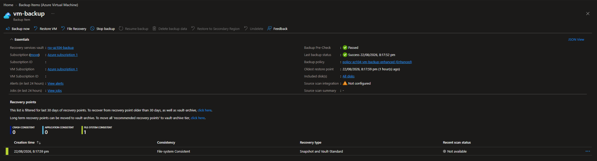
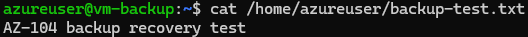
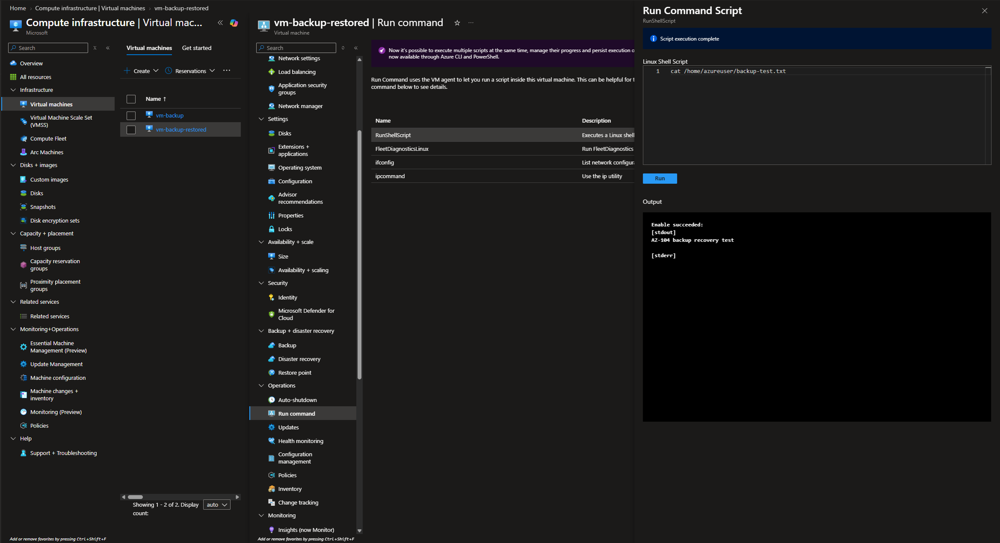
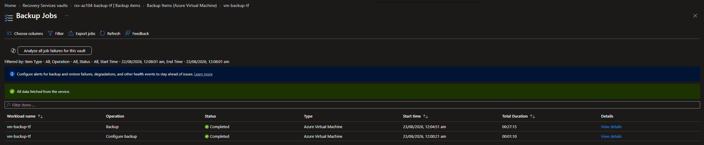
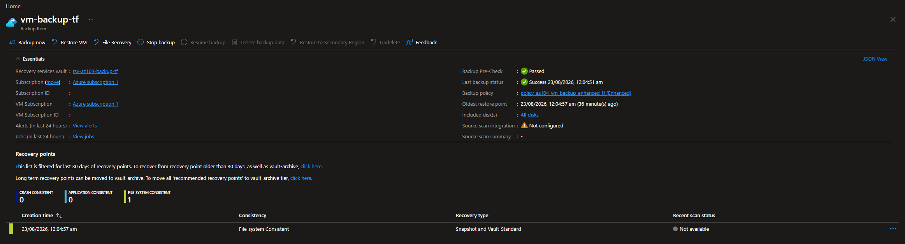
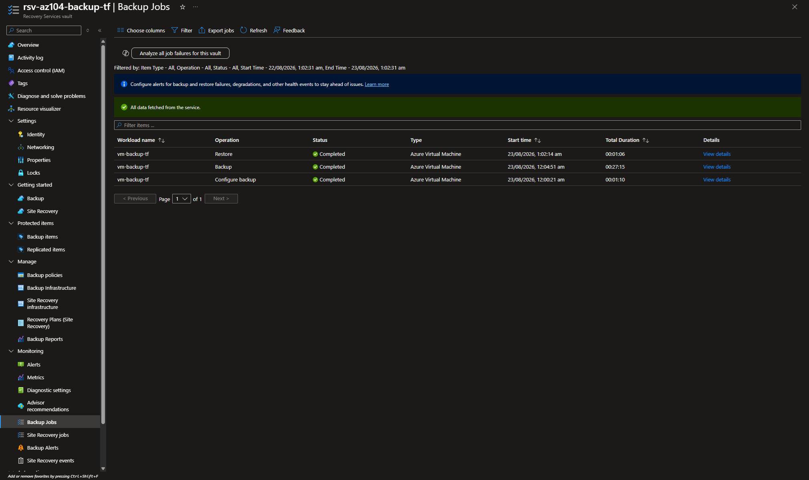
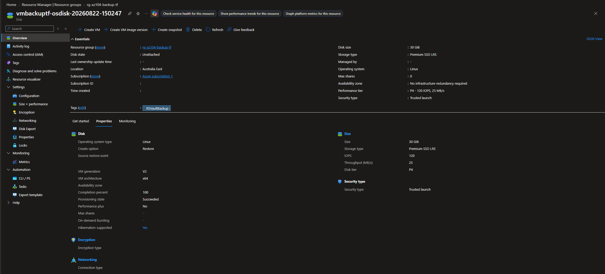

# Configuration 14 — Azure Backup and Recovery

## Configuration Overview

This configuration demonstrates Azure virtual machine backup and recovery using **Azure Backup**, **Recovery Services vaults**, **backup policies**, **recovery points**, and **restore operations**.

The environment was first implemented and validated through the Azure Portal, then recreated with Terraform as Infrastructure as Code.

## Architecture

```text
Linux VM
   ↓
Recovery Services Vault
   ↓
Enhanced Backup Policy
   ↓
Protected VM
   ↓
Recovery Point
├── File Recovery
├── VM Recovery
└── Disk Restore
```

## What I Configured

### VM Backup and Recovery Point

Configured a Recovery Services vault and enhanced backup policy to protect an Azure Linux VM.

Triggered an on-demand backup and confirmed that Azure Backup successfully created a recovery point.

### File and VM Recovery

Validated file-level recovery from an Azure VM backup.

Also validated VM recovery from a recovery point to confirm that the protected workload could be restored successfully.

### Disk Restore

Performed a disk restore from a recovery point and verified that Azure successfully created an unattached managed disk.

The restored disk showed:

- Create option: **Restore**
- Completion: **100%**
- Provisioning state: **Succeeded**
- Operating system: **Linux**
- Size: **30 GiB**
- Storage type: **Premium SSD LRS**

## Terraform Implementation

The core backup and recovery architecture was recreated with Terraform.

Terraform managed **10 Azure resources**:

- 1 resource group
- 1 virtual network
- 1 subnet
- 1 network security group
- 1 network interface
- 1 NIC-to-NSG association
- 1 Linux virtual machine
- 1 Recovery Services vault
- 1 enhanced VM backup policy
- 1 protected VM backup item

The Terraform deployment completed successfully with:

```text
10 added, 0 changed, 0 destroyed
```

An on-demand backup was successfully completed for the Terraform-managed VM.

The generated recovery point was then used to perform and verify a managed disk restore.

### Terraform Files

```text
terraform/
├── .terraform.lock.hcl
├── main.tf
├── outputs.tf
├── providers.tf
├── variables.tf
└── versions.tf
```

## Security and Repository Practices

- Azure subscription IDs were removed from public screenshots.
- An NSG was associated with the VM network interface.
- Terraform state and working-directory files were excluded from source control.
- Temporary restore resources were deleted after validation.
- Terraform-managed infrastructure was destroyed after testing to control Azure costs.
- Auto-created Azure Backup restore-point resources were removed during final cleanup.

## Evidence

### VM Backup Recovery Point



### File Recovery Validation



### Full VM Restore Validation



### Terraform VM Backup Protection


### Terraform Backup Job Completed



### Terraform Recovery Point



### Terraform Restore Job Completed



### Restored Disk Verification



## Skills Demonstrated

- Azure Backup
- Recovery Services vaults
- Azure VM backup policies
- VM backup protection
- Recovery points
- File-level recovery
- Azure VM recovery
- Managed disk restore
- Backup and restore job monitoring
- Azure PowerShell
- Terraform Infrastructure as Code
- Azure resource cleanup
- Azure cost control

## Outcome

This configuration demonstrated an end-to-end Azure VM backup and recovery workflow from protection and recovery-point creation through file, VM and disk restore validation.

The same core backup architecture was then reproduced with Terraform, successfully backed up, restored and fully cleaned up after testing.