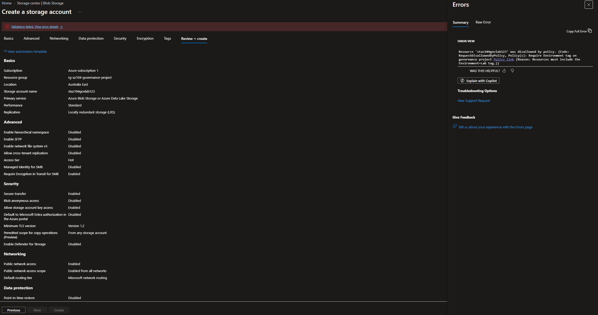
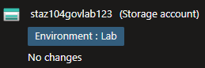
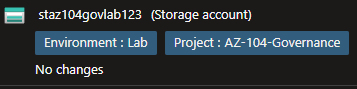
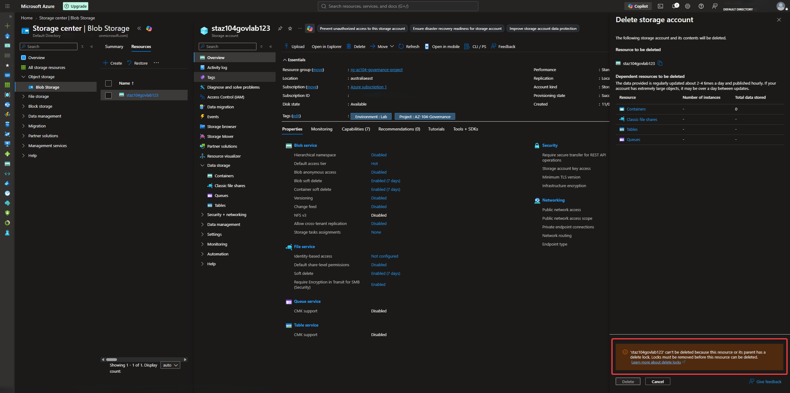

# Azure Policy, Governance and Resource Protection

## Overview

I built and validated an Azure governance environment using **Azure Policy**, resource tagging, policy remediation, management-group hierarchy and resource locks.

The project applied governance controls to a dedicated Azure resource group and tested them through non-compliant deployment, compliant deployment, remediation and deletion-protection scenarios.

## Architecture

```text
Tenant Root Group
   │
   ├── Azure Subscription
   │     ↓
   │   rg-az104-governance-project
   │     ├── Resource Tags
   │     ├── Azure Policy
   │     │    ├── Deny non-compliant resources
   │     │    └── Modify missing tags
   │     │         └── System-assigned managed identity
   │     └── Delete Lock
   │
   └── AZ-104 Governance Management Group
         └── Hierarchy practice
```

The management group was created to practise Azure governance hierarchy.

The subscription remained under the Tenant Root Group, while the active governance controls in this project were applied at the dedicated resource-group scope.

## What I Implemented

### Governance Scope and Tagging

Created the dedicated resource group:

```text
rg-az104-governance-project
```

Applied the following governance tags:

```text
Environment = Lab
ManagedBy   = IT
Project     = AZ104-Governance
```

These tags provided consistent environment classification, administrative ownership and project identification.

### Policy Enforcement

Assigned the built-in policy:

```text
Require a tag and its value on resources
```

Required value:

```text
Environment = Lab
```

A storage account deployment was deliberately attempted without the required tag.

Azure Policy blocked the deployment.

The deployment was then repeated with the required tag and completed successfully.

This validated active **Deny** enforcement rather than audit-only compliance reporting.

### Policy Remediation

Assigned the built-in policy:

```text
Inherit a tag from the resource group if missing
```

The policy inherited the `Project` tag from the resource group:

```text
Project = AZ104-Governance
```

The policy assignment used a **system-assigned managed identity** to support the Modify effect and remediation operation.

A remediation task was then used to apply the missing `Project` tag successfully.

This demonstrated the difference between:

```text
Deny
   ↓
Prevents non-compliant deployment

Modify
   ↓
Corrects or adds required configuration
```

### Resource Protection

Created a resource-group Delete lock:

```text
lock-governance-project
```

A deletion attempt against the protected storage account was deliberately performed.

Azure blocked the deletion because the storage account inherited the resource-group lock.

This validated an additional protection layer against accidental resource deletion.

## Governance Controls

The project validates three governance mechanisms:

```text
Azure Policy
   ↓
Enforces or remediates resource configuration

Managed Identity
   ↓
Supports authorised policy remediation

Resource Locks
   ↓
Protect resources from accidental management operations
```

Management-group hierarchy was also created for scope and hierarchy practice, but policy inheritance from that management group was not configured as part of this project.

## Security and Repository Practices

- Governance policies were scoped to a dedicated resource group
- Policy enforcement was validated with a deliberately non-compliant deployment
- A compliant deployment was tested after correcting the required tag
- A Modify policy was validated through an actual remediation task
- A system-assigned managed identity supported policy remediation
- Resource tagging was used for consistent environment classification
- A Delete lock was validated through a blocked deletion attempt
- Management-group hierarchy was documented without claiming policy inheritance that was not configured
- Public screenshots excluded unnecessary personal and subscription-specific information

## Evidence

### Policy Denial



### Compliant Resource Deployment



### Policy Remediation



### Resource Lock Protection



## Key Skills

- Azure Governance
- Azure Policy
- Policy assignments
- Deny policy effects
- Modify policy effects
- Policy remediation
- System-assigned managed identities
- Azure resource tagging
- Management groups
- Governance scope and hierarchy
- Resource locks
- Compliance testing
- Resource protection
- Azure administration and troubleshooting

## Result

Validated an Azure governance workflow covering policy enforcement, automated tag remediation, resource classification and deletion protection.

Azure Policy blocked a non-compliant deployment, allowed a compliant deployment and remediated missing metadata through a system-assigned managed identity. A resource-group Delete lock also prevented deletion of a protected resource.