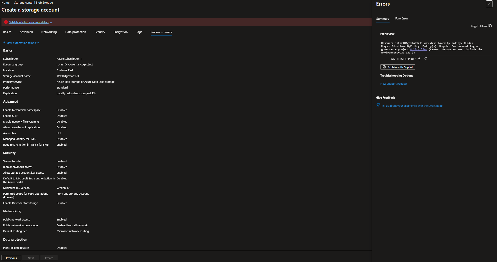
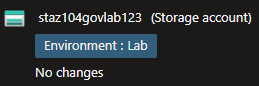
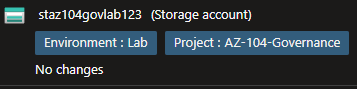
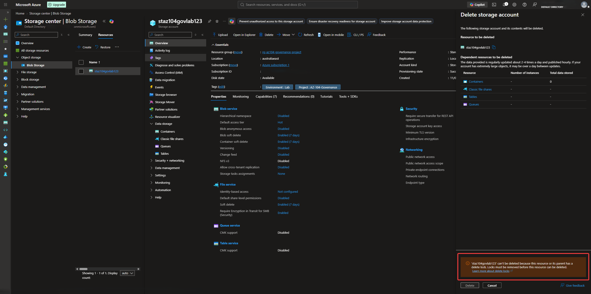

# Azure Identity, Access and Governance

## Project Overview

This project demonstrates an integrated Azure governance environment using **Azure Policy**, resource tagging, policy remediation, managed identities, management groups and resource locks.

Multiple governance controls were applied to a dedicated Azure environment and validated through real deployment, remediation and resource-protection tests.

## Architecture

```text
Tenant Root Group
   │
   ├── Azure Subscription
   │     ↓
   │   rg-az104-governance-project
   │     ├── Resource Tags
   │     ├── Azure Policy
   │     │    ├── Deny non-compliant resources
   │     │    └── Modify missing tags
   │     ├── Managed Identity
   │     └── Delete Lock
   │
   └── AZ-104 Governance Management Group
         └── Hierarchy practice
```

The management group was created to demonstrate Azure governance hierarchy.

The subscription remained under the Tenant Root Group, while the active governance controls in this project were applied at the dedicated resource group scope.

## What I Implemented

### Governance Scope and Tagging

Created the dedicated resource group:

```text
rg-az104-governance-project
```

Applied the following governance tags:

```text
Environment = Lab
ManagedBy   = IT
Project     = AZ104-Governance
```

These tags provided consistent environment classification, administrative ownership and project identification.

### Policy Enforcement

Assigned the built-in policy:

```text
Require a tag and its value on resources
```

Required value:

```text
Environment = Lab
```

A storage account deployment was deliberately attempted without the required tag.

Azure Policy blocked the deployment.

The deployment was then repeated with the required tag and completed successfully.

This validated active **Deny policy enforcement** rather than audit-only compliance reporting.

### Policy Remediation

Assigned the built-in policy:

```text
Inherit a tag from the resource group if missing
```

The policy used the `Project` tag from the resource group:

```text
Project = AZ104-Governance
```

A **system-assigned managed identity** supported the Modify policy so Azure Policy could update existing resources.

A remediation task was then used to apply the missing Project tag successfully.

This demonstrated the difference between:

```text
Deny
   ↓
Prevents non-compliant deployment

Modify
   ↓
Corrects existing configuration
```

### Resource Protection

Created a resource-group Delete lock:

```text
lock-governance-project
```

A deletion attempt against the protected storage account was deliberately performed.

Azure blocked the deletion because the resource inherited the resource-group lock.

This validated an additional protection layer against accidental resource deletion.

## Governance Model

The project demonstrates three complementary Azure governance controls:

```text
Azure RBAC
   ↓
Controls who can perform actions

Azure Policy
   ↓
Controls which configurations are allowed or required

Resource Locks
   ↓
Protect resources from management operations
```

These controls address different governance requirements and work together as part of a broader Azure administration model.

## Security and Governance Practices

- Governance policies were scoped to a dedicated resource group.
- Policy enforcement was validated using a deliberately non-compliant deployment.
- A Modify policy was validated through an actual remediation task.
- A managed identity was used to support policy remediation.
- Resource tagging was used for consistent environment classification.
- A Delete lock was validated through a blocked deletion attempt.
- Management-group hierarchy was documented without claiming policy inheritance that was not configured.
- Public screenshots excluded unnecessary personal and subscription-specific information.

## Evidence

### Policy Denial



### Compliant Resource Deployment



### Policy Remediation



### Resource Lock Protection



## Skills Demonstrated

- Azure Governance
- Azure Policy
- Policy assignments
- Deny policy effects
- Modify policy effects
- Policy remediation
- System-assigned managed identities
- Azure resource tagging
- Management groups
- Governance scope and hierarchy
- Resource locks
- Compliance testing
- Resource protection
- Azure administration and troubleshooting

## Outcome

This project demonstrated an integrated Azure governance workflow covering policy enforcement, automated remediation, resource classification and deletion protection.

Azure Policy successfully blocked a non-compliant deployment, allowed a compliant deployment, remediated missing metadata through a managed identity, and worked alongside a resource-group Delete lock to protect the environment.