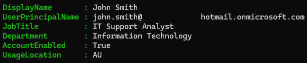
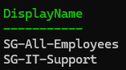
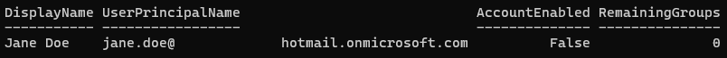
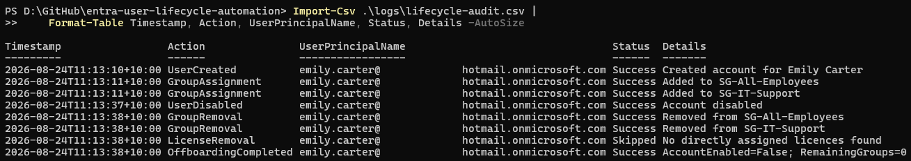
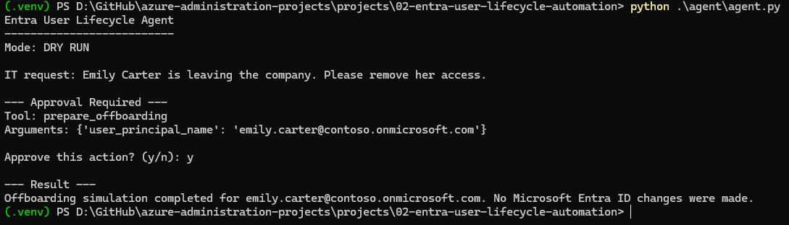
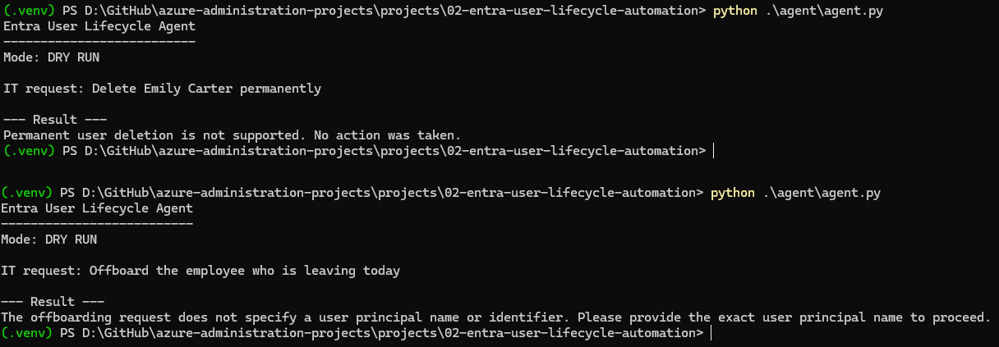

# Entra User Lifecycle Automation

## Overview

Built a PowerShell and Microsoft Graph workflow to automate Microsoft Entra ID onboarding and offboarding.

The workflow covers user creation, profile configuration, security-group assignment, temporary-password handling, account disabling, sign-in session revocation, direct group removal, licence handling and audit logging.

The project also includes a separate local Python and Ollama agent for onboarding and offboarding requests. The agent operates in dry-run mode with identity validation and administrator approval controls.

## Architecture

### Lifecycle Automation

```text
Administrator
     |
     v
PowerShell 7
     |
     v
Microsoft Graph
     |
     v
Microsoft Entra ID
```

### Agent Request Layer

```text
Onboarding / offboarding request
        |
        v
Python + Ollama
        |
        v
Identity validation
        |
        v
Administrator approval
        |
        v
Simulated lifecycle action
```

## Repository Structure

```text
02-entra-user-lifecycle-automation/
├── agent/
│   └── agent.py
├── data/
│   └── sample-users.json
├── scripts/
│   ├── Common.ps1
│   ├── New-User.ps1
│   └── Offboard-User.ps1
├── screenshots/
│   ├── automated-user-validation.png
│   ├── automated-group-membership.png
│   ├── automated-offboarding-validation.png
│   ├── lifecycle-audit-trail.png
│   ├── agent-offboarding-request.png
│   └── agent-safety-controls.png
├── .gitignore
└── README.md
```

Generated audit logs, Python virtual environments and cache files are excluded from source control.

## Lifecycle Automation

### Onboarding

`scripts/New-User.ps1`:

- Validates the Microsoft Graph session
- Checks for an existing UPN
- Validates target security groups
- Generates a temporary password
- Creates the user
- Requires password change at first sign-in
- Assigns security groups
- Writes audit events

### Offboarding

`scripts/Offboard-User.ps1`:

- Locates the user
- Disables the account
- Revokes sign-in sessions
- Removes direct group memberships
- Checks and removes directly assigned licences when applicable
- Validates the final account state
- Writes audit events

The original lab validation confirmed:

```text
AccountEnabled = False
RemainingGroups = 0
```

Dynamic group memberships are skipped because they are controlled by Microsoft Entra membership rules.

The lab tenant did not contain an assignable subscribed licence SKU, so the live validation covered the no-licence path.

## Agent-Assisted Requests

`agent/agent.py` provides a local interface for onboarding and offboarding requests using test identities from `data/sample-users.json`.

The agent requires administrator approval for onboarding and offboarding and includes checks for:

- Existing or unknown users
- Duplicate onboarding requests
- Missing onboarding attributes
- Ambiguous offboarding requests
- Unsupported permanent account deletion

For offboarding, the selected identity must exist in the local test data and must be explicitly identified in the original request.

During testing, an ambiguous offboarding request caused the model to infer an account that had not been supplied. I added code-level identity validation so the target must exist in the local test data and match the identity provided in the request before administrator approval can be presented.

The agent remains dry-run only and does not execute the PowerShell scripts or make live Microsoft Entra ID changes.

## Security and Validation

- Dedicated Microsoft Entra app registration with delegated Microsoft Graph permissions
- Graph permissions include `User.Read.All`, `User.ReadWrite.All`, `User.EnableDisableAccount.All`, `GroupMember.ReadWrite.All` and `LicenseAssignment.ReadWrite.All`
- No client secrets, access tokens or passwords stored in the repository
- Temporary passwords excluded from audit logs
- Target-group validation before user creation
- Sign-in session revocation during offboarding
- Administrator approval for agent-assisted requests
- Code-level identity validation before offboarding approval
- Audit records include timestamp, action, user principal name, status and details
- Generated audit logs excluded from version control

## Evidence

### Automated User Validation

The provisioned Entra user was validated through Microsoft Graph after creation.



### Automated Group Membership

Microsoft Graph automation successfully assigned the user to the required Entra security groups.



### Automated Offboarding Validation

The offboarding validation confirmed that the account was disabled and direct group memberships were removed.



### End-to-End Lifecycle Audit Trail

The audit trail records the validated lifecycle from account creation through group assignment and offboarding.



### Agent Offboarding Request

The agent resolved an offboarding request to the correct test identity, required administrator approval and completed the action in dry-run mode.



### Agent Safety Controls

The agent rejected permanent deletion and ambiguous offboarding requests without a specific identity.



## Technologies

- Microsoft Entra ID
- Microsoft Graph
- Microsoft Graph PowerShell SDK
- PowerShell 7
- Python
- Ollama
- Git
- GitHub

## Result

Built and validated a reusable Microsoft Entra ID onboarding and offboarding workflow using PowerShell and Microsoft Graph, with separate dry-run agent controls for request validation and administrator approval.